# Schema Management Process Flow

## Overview

This diagram illustrates the complete schema management process flow in the DAO Registry system, from initial schema creation through to cross-chain data sharing and API integration.

## Process Flow Diagram

```mermaid
graph TB
    %% Administrator Actions
    Admin[Administrator] --> Init[Initialize Schema Creation]
    
    %% Schema Creation Process
    Init --> ValidateInput[Validate Input Parameters]
    ValidateInput --> CheckPermissions{Check Administrator Permissions}
    CheckPermissions -->|Authorized| ValidateSchema[Validate Schema Structure]
    CheckPermissions -->|Unauthorized| Error1[Error: Insufficient Permissions]
    
    %% Schema Validation
    ValidateSchema --> CheckFields{Validate Field Definitions}
    CheckFields -->|Valid| CheckMetadata[Validate Required Metadata]
    CheckFields -->|Invalid| Error2[Error: Invalid Field Structure]
    
    %% Metadata Validation
    CheckMetadata --> CheckPriority[Assign Priority Level]
    CheckPriority --> CRITICAL[CRITICAL: Core System Schemas]
    CheckPriority --> HIGH[HIGH: Important Operational]
    CheckPriority --> MEDIUM[MEDIUM: Standard Features]
    CheckPriority --> LOW[LOW: Optional Enhancements]
    
    %% Schema Storage
    CRITICAL --> StoreSchema[Store Schema in Contract State]
    HIGH --> StoreSchema
    MEDIUM --> StoreSchema
    LOW --> StoreSchema
    
    %% State Management
    StoreSchema --> UpdateStats[Update Statistics Counters]
    UpdateStats --> UpdateMappings[Update Storage Mappings]
    UpdateMappings --> EmitEvent[Emit SchemaDefined Event]
    
    %% Querying Process
    EmitEvent --> QuerySystem[Query System Initialization]
    QuerySystem --> OnChainQuery[On-Chain Schema Queries]
    QuerySystem --> OffChainQuery[Off-Chain API Queries]
    
    %% Schema Retrieval
    OnChainQuery --> GetSchema[Get Complete Schema Definition]
    OffChainQuery --> GetSchema
    GetSchema --> FieldQuery[Field-Level Queries]
    FieldQuery --> SchemaValidation[Schema Validation]
    
    %% Schema Updates
    SchemaValidation --> UpdateProcess[Schema Update Process]
    UpdateProcess --> StoreOldVersion[Store Old Version Info]
    StoreOldVersion --> RemoveOldSchema[Remove Old Schema]
    RemoveOldSchema --> AddNewSchema[Add New Schema]
    AddNewSchema --> UpdateVersion[Update Version Number]
    UpdateVersion --> EmitUpdateEvent[Emit SchemaUpdated Event]
    
    %% Schema Removal
    EmitUpdateEvent --> RemovalProcess[Schema Removal Process]
    RemovalProcess --> DecrementStats[Decrement Statistics Counters]
    DecrementStats --> ClearMappings[Clear Storage Mappings]
    ClearMappings --> RemoveReferences[Remove All References]
    RemoveReferences --> EmitRemovalEvent[Emit SchemaDeprecated Event]
    
    %% Access Control
    EmitRemovalEvent --> AccessControl[Multi-Tier Access Control]
    AccessControl --> Owner[Contract Owner: Full Privileges]
    AccessControl --> Admin[Administrators: Schema Management]
    AccessControl --> Moderator[Moderators: Data Management]
    AccessControl --> DataProvider[Data Providers: CCIP Data Storage]
    
    %% CCIP Integration
    DataProvider --> CCIPIntegration[CCIP Cross-Chain Integration]
    CCIPIntegration --> StandardizedData[Standardized Data Source]
    StandardizedData --> CrossChainQuery[Cross-Chain Applications]
    CrossChainQuery --> UnifiedDataLayer[Unified Data Layer]
    
    %% Event System
    UnifiedDataLayer --> EventSystem[Comprehensive Event Logging]
    EventSystem --> SchemaEvents[Schema Creation/Update/Removal Events]
    EventSystem --> UsageEvents[Usage Pattern Tracking]
    EventSystem --> AuditTrail[Audit Trail Maintenance]
    
    %% Statistical Tracking
    AuditTrail --> Statistics[Statistical Tracking System]
    Statistics --> TotalSchemas[Total Schema Count]
    Statistics --> PriorityStats[Schemas by Priority Level]
    Statistics --> CategoryStats[Schemas by Category]
    Statistics --> UsageTrends[Usage Trend Analysis]
    
    %% Error Handling
    UsageTrends --> ErrorHandling[Comprehensive Error Handling]
    ErrorHandling --> InputValidation[Input Validation]
    ErrorHandling --> BusinessLogic[Business Logic Validation]
    ErrorHandling --> DescriptiveErrors[Descriptive Error Messages]
    
    %% Gas Optimization
    DescriptiveErrors --> GasOptimization[Gas-Efficient Operations]
    GasOptimization --> OptimizedStorage[Optimized Storage Patterns]
    GasOptimization --> ModularDesign[Modular Design]
    GasOptimization --> EasyExtension[Easy Extension Capability]
    
    %% External Integration
    EasyExtension --> ExternalIntegration[External System Integration]
    ExternalIntegration --> APIEndpoints[API Endpoint Discovery]
    ExternalIntegration --> DocumentationURLs[Documentation URL Access]
    ExternalIntegration --> WebApps[Web Application Integration]
    ExternalIntegration --> MobileApps[Mobile App Integration]
    ExternalIntegration --> BlockchainSystems[Other Blockchain Systems]
    
    %% Validation System
    BlockchainSystems --> ValidationSystem[Data Integrity Validation]
    ValidationSystem --> SchemaLevel[Schema-Level Validation]
    ValidationSystem --> FieldLevel[Field-Level Validation]
    ValidationSystem --> CustomRules[Custom Validation Rules]
    ValidationSystem --> DataCorruption[Prevent Data Corruption]
    
    %% Version Control
    DataCorruption --> VersionControl[Version Control System]
    VersionControl --> SemanticVersioning[Semantic Versioning]
    VersionControl --> BackwardCompatibility[Backward Compatibility]
    VersionControl --> GradualTransitions[Gradual Schema Transitions]
    VersionControl --> BreakingChanges[Prevent Breaking Changes]
    
    %% Category System
    BreakingChanges --> CategorySystem[Organizational Category System]
    CategorySystem --> FunctionGrouping[Function-Based Grouping]
    CategorySystem --> DomainGrouping[Domain-Based Grouping]
    CategorySystem --> EfficientQuerying[Efficient Schema Querying]
    CategorySystem --> Discovery[Schema Discovery]
    
    %% Final Integration
    Discovery --> FinalIntegration[Final System Integration]
    FinalIntegration --> InteroperableApps[Interoperable Applications]
    FinalIntegration --> CrossChainPlatforms[Cross-Chain Platform Support]
    FinalIntegration --> DAOPlatforms[DAO Platform Compatibility]
    FinalIntegration --> FutureProof[Future-Proof Architecture]
    
    %% Error Handling Connections
    Error1 --> ErrorHandling
    Error2 --> ErrorHandling
    
    %% Styling
    classDef adminAction fill:#e1f5fe,stroke:#01579b,stroke-width:2px
    classDef validation fill:#f3e5f5,stroke:#4a148c,stroke-width:2px
    classDef storage fill:#e8f5e8,stroke:#1b5e20,stroke-width:2px
    classDef integration fill:#fff3e0,stroke:#e65100,stroke-width:2px
    classDef error fill:#ffebee,stroke:#c62828,stroke-width:2px
    
    class Admin,Init adminAction
    class ValidateInput,CheckPermissions,ValidateSchema,CheckFields,CheckMetadata,CheckPriority validation
    class StoreSchema,UpdateStats,UpdateMappings,EmitEvent,GetSchema,FieldQuery storage
    class CCIPIntegration,StandardizedData,CrossChainQuery,UnifiedDataLayer,ExternalIntegration integration
    class Error1,Error2 error
```

## Key Process Components

### 1. Schema Creation Flow
- **Input Validation**: Ensures all required parameters are provided
- **Permission Checking**: Verifies administrator authorization
- **Schema Validation**: Validates field definitions and metadata
- **Priority Assignment**: Categorizes schemas by importance level
- **State Storage**: Stores schema in contract state with optimized patterns

### 2. Querying and Retrieval
- **On-Chain Queries**: Direct contract calls for schema information
- **Off-Chain Queries**: API-based access for external systems
- **Field-Level Access**: Granular field information retrieval
- **Schema Validation**: Ensures data structure integrity

### 3. Schema Evolution
- **Version Control**: Semantic versioning with backward compatibility
- **Atomic Updates**: Complete schema replacement with event logging
- **Clean Removal**: Comprehensive cleanup of deprecated schemas
- **Event Tracking**: Complete audit trail of all changes

### 4. Access Control System
- **Multi-Tier Permissions**: Hierarchical access control
- **Role-Based Access**: Different capabilities for different roles
- **Security Validation**: Ensures secure schema management
- **Operational Flexibility**: Balances security with usability

### 5. Cross-Chain Integration
- **CCIP Compatibility**: Standardized data formats for cross-chain use
- **Unified Data Layer**: Consistent data access across networks
- **API Integration**: RESTful endpoints for external systems
- **Documentation Access**: Comprehensive schema documentation

### 6. Monitoring and Analytics
- **Event System**: Real-time monitoring of schema activities
- **Statistical Tracking**: Usage patterns and system health metrics
- **Audit Trails**: Complete history of all schema operations
- **Performance Monitoring**: Gas optimization and efficiency tracking

## Benefits of This Architecture

1. **Standardization**: Consistent data structures across the ecosystem
2. **Interoperability**: Cross-chain and cross-platform compatibility
3. **Security**: Comprehensive access control and validation
4. **Scalability**: Modular design for easy extension
5. **Transparency**: Complete audit trail and event logging
6. **Efficiency**: Gas-optimized operations and storage
7. **Flexibility**: Version-controlled schema evolution
8. **Integration**: Seamless external system connectivity

This schema management process represents a fundamental shift from isolated, platform-specific data structures to a unified, standardized system that serves the entire blockchain ecosystem while maintaining security, efficiency, and interoperability. 