# DAO Registry Contract Interactions Diagram

## System Architecture Overview

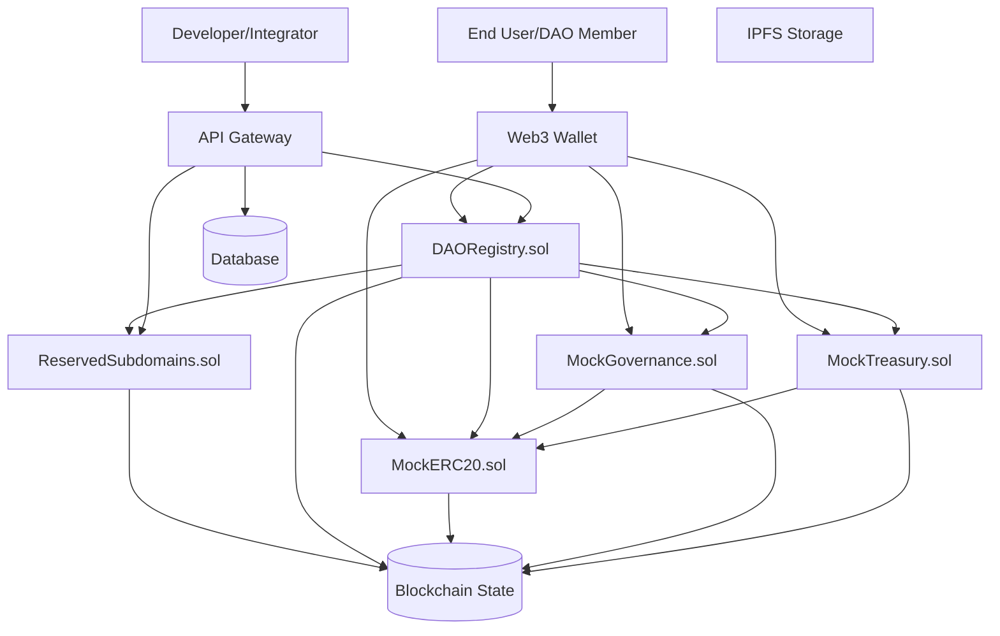

## Contract Relationships and Dependencies

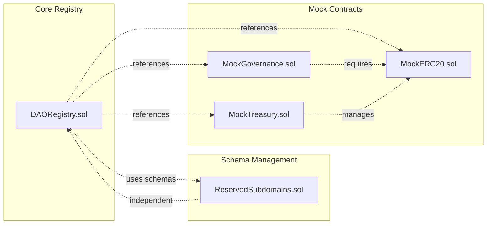

## Data Flow Between Contracts

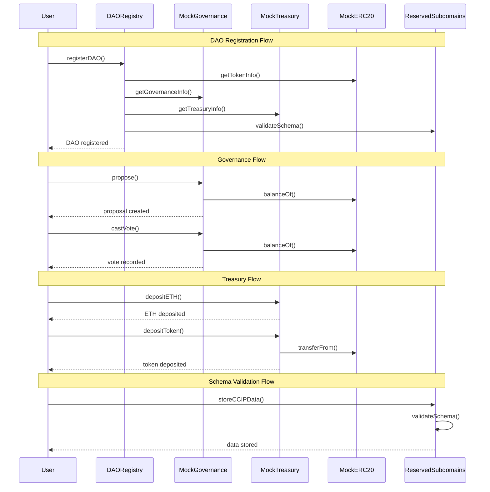

## Contract Responsibilities and Functions

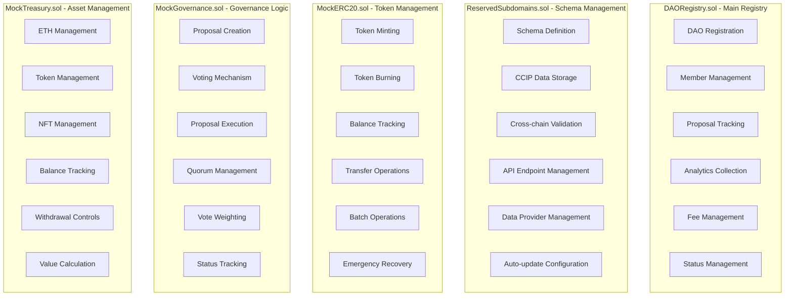

## Cross-Contract Communication Patterns

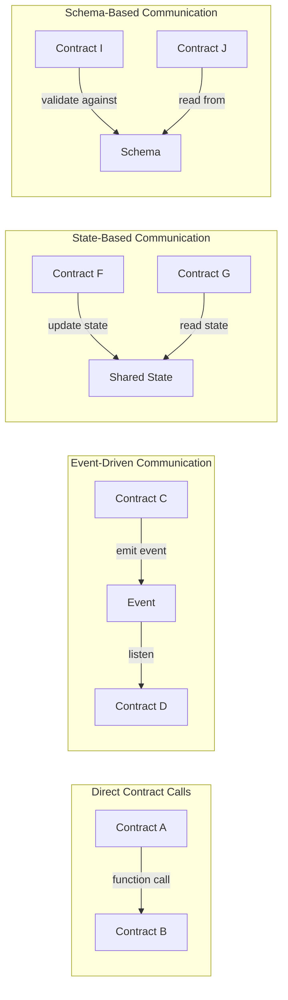

## Contract Integration Points

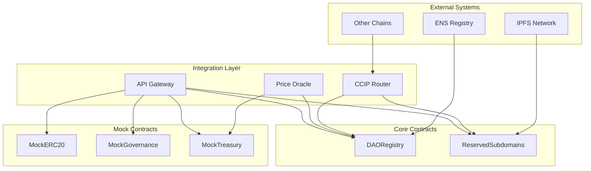

## Contract State Management

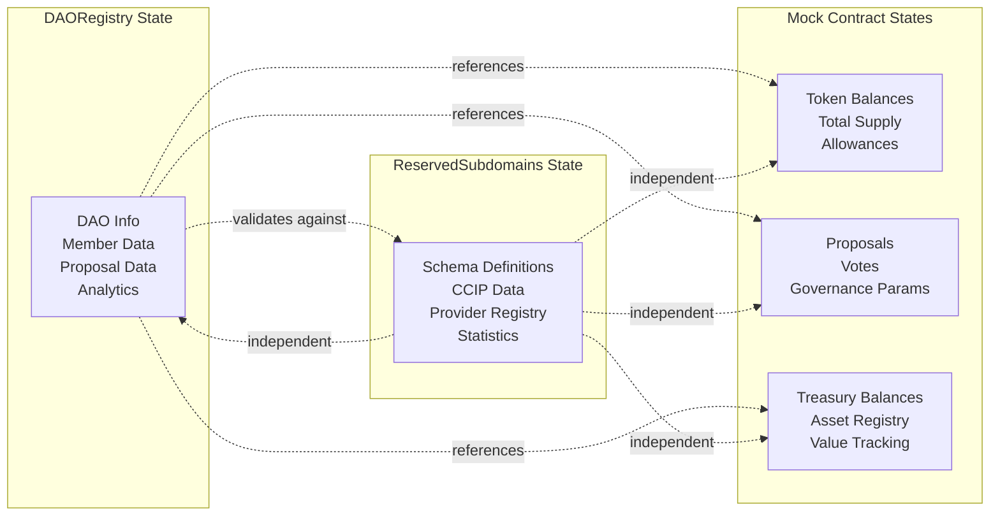

## Security and Access Control

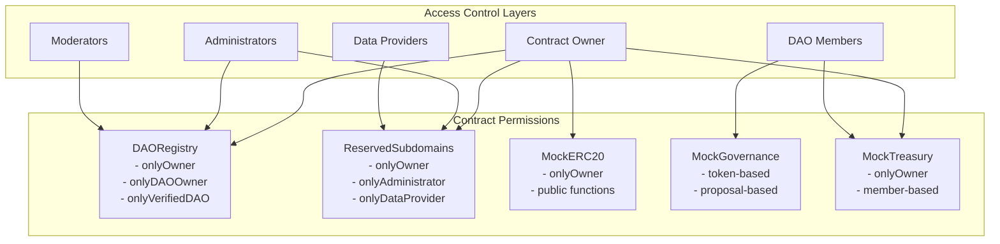

## Event Emission and Monitoring

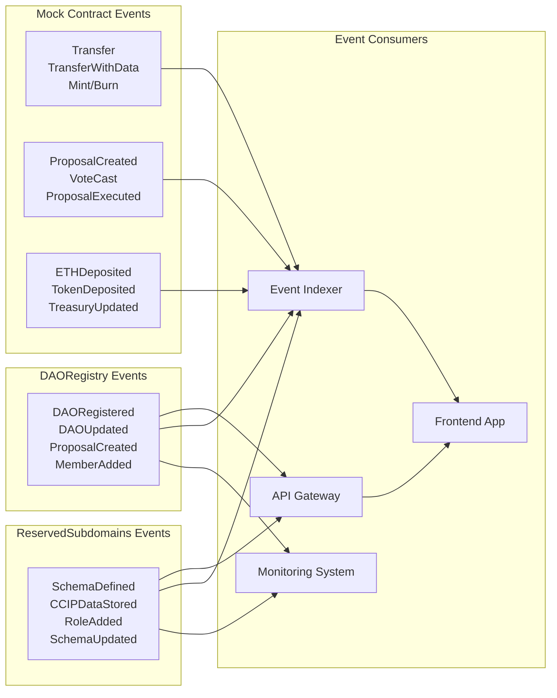

## Contract Deployment and Initialization

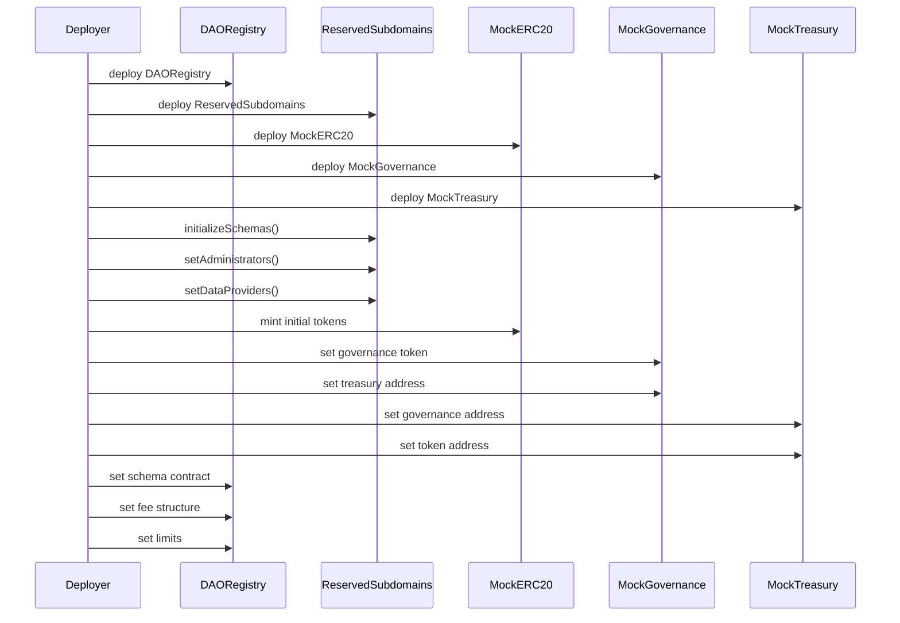

## Contract Testing and Validation

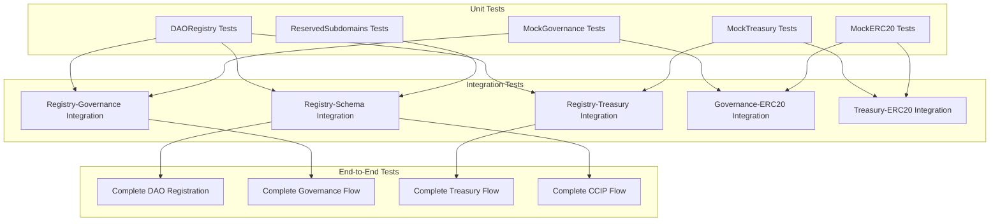

## Contract Upgrade and Migration Strategy

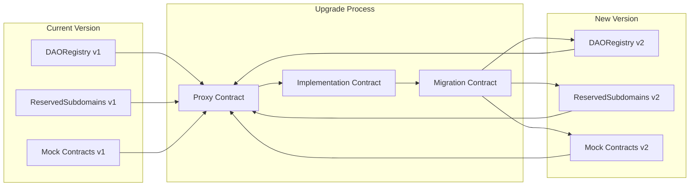

## Summary of Contract Interactions

### **Core Contract Relationships:**

1. **DAORegistry.sol** - Central registry that:
   - References MockERC20 for token information
   - References MockGovernance for governance data
   - References MockTreasury for treasury information
   - Uses ReservedSubdomains for schema validation

2. **ReservedSubdomains.sol** - Independent schema manager that:
   - Provides standardized data schemas
   - Stores CCIP-compatible data
   - Manages cross-chain data validation
   - Operates independently of other contracts

3. **Mock Contracts** - Testing infrastructure:
   - **MockERC20**: Provides token functionality for governance
   - **MockGovernance**: Implements governance logic using tokens
   - **MockTreasury**: Manages assets and integrates with tokens

### **Key Interaction Patterns:**

- **Direct Function Calls**: Contracts call each other's functions directly
- **Event-Driven Communication**: Contracts emit events that others listen to
- **State-Based Communication**: Contracts read each other's state
- **Schema-Based Validation**: Contracts validate data against schemas

### **Security Model:**

- **Ownable**: Core contracts have owner controls
- **Role-Based**: Different access levels for different functions
- **Token-Based**: Governance requires token ownership
- **Provider-Based**: Data providers have specific permissions

### **Data Flow:**

1. **Registration**: User → DAORegistry → Validates against schemas
2. **Governance**: User → MockGovernance → Uses MockERC20 tokens
3. **Treasury**: User → MockTreasury → Manages MockERC20 tokens
4. **Schema**: User → ReservedSubdomains → Stores CCIP data

This architecture provides a  , testable, and extensible system for DAO management with cross-chain compatibility. 