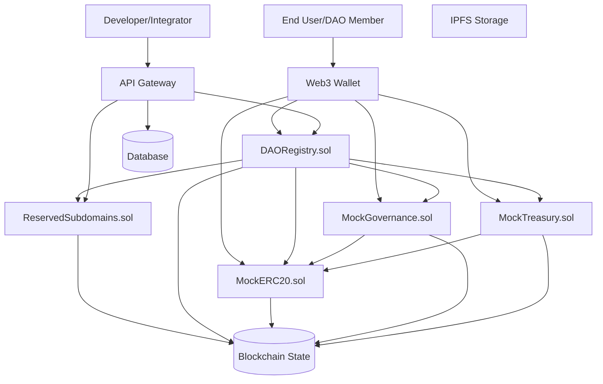
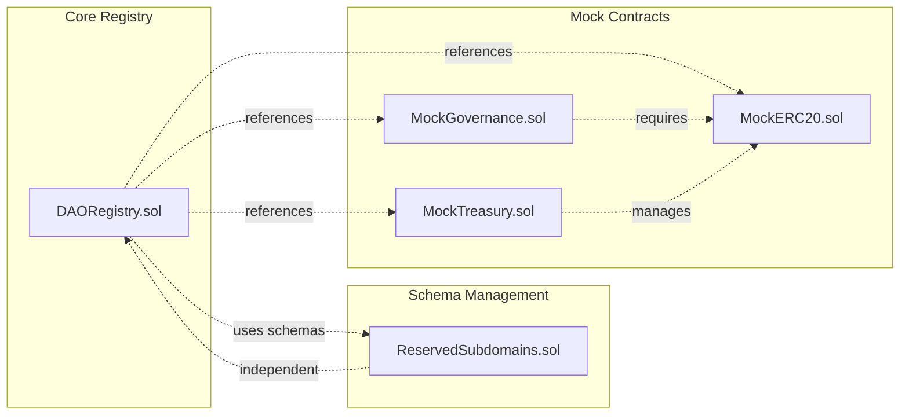
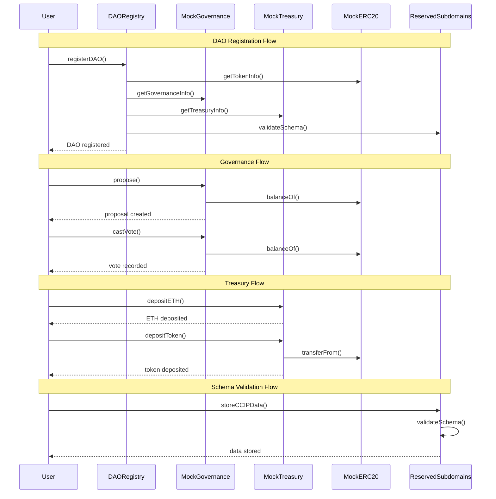
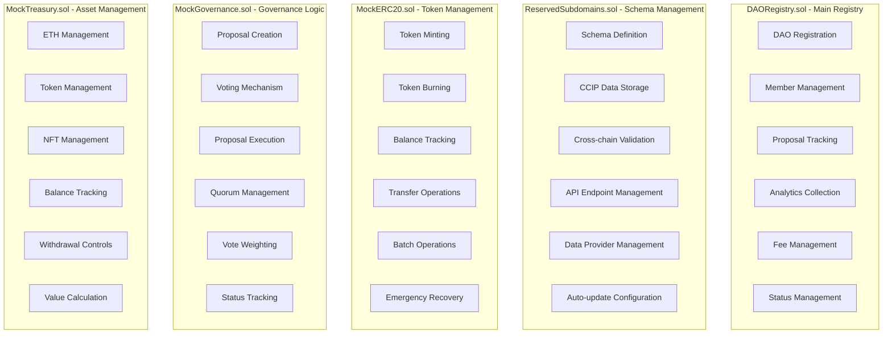
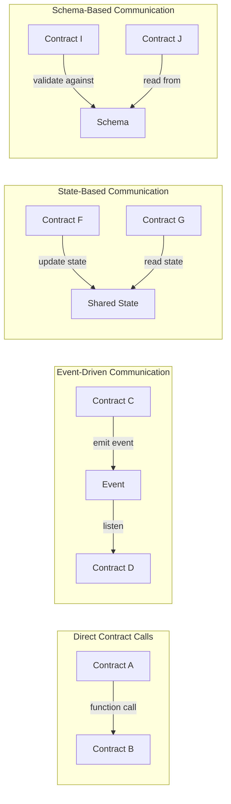
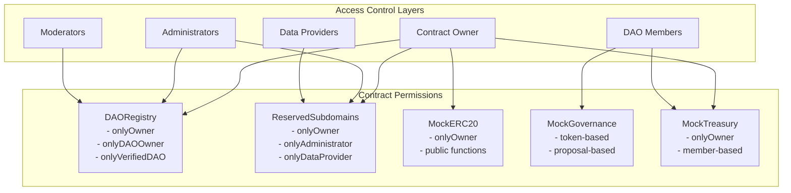

# DAO Registry Contract Schema

## Contract Interaction Schema

```mermaid
graph TB
    %% External Entities
    USER[End User/DAO Member]
    DEVELOPER[Developer/Integrator]
    WALLET[Web3 Wallet]
    
    %% Core Registry Contract
    REGISTRY[DAORegistry.sol]
    
    %% Mock Contracts for Testing
    MOCK_ERC20[MockERC20.sol]
    MOCK_GOV[MockGovernance.sol]
    MOCK_TREASURY[MockTreasury.sol]
    
    %% Schema Management
    SCHEMA[ReservedSubdomains.sol]
    
    %% Data Stores
    CHAIN[(Blockchain State)]
    IPFS[IPFS Storage]
    DB[(Database)]
    
    %% API Layer
    API[API Gateway]
    
    %% Relationships
    USER --> WALLET
    WALLET --> REGISTRY
    WALLET --> MOCK_ERC20
    WALLET --> MOCK_GOV
    WALLET --> MOCK_TREASURY
    
    REGISTRY --> MOCK_ERC20
    REGISTRY --> MOCK_GOV
    REGISTRY --> MOCK_TREASURY
    REGISTRY --> SCHEMA
    
    MOCK_GOV --> MOCK_ERC20
    MOCK_TREASURY --> MOCK_ERC20
    
    SCHEMA --> CHAIN
    REGISTRY --> CHAIN
    MOCK_ERC20 --> CHAIN
    MOCK_GOV --> CHAIN
    MOCK_TREASURY --> CHAIN
    
    API --> REGISTRY
    API --> SCHEMA
    API --> DB
    
    DEVELOPER --> API
```

## Contract Dependencies

```mermaid
graph LR
    %% Core Contracts
    subgraph "Core Registry"
        REGISTRY[DAORegistry.sol]
    end
    
    subgraph "Schema Management"
        SCHEMA[ReservedSubdomains.sol]
    end
    
    subgraph "Mock Contracts"
        MOCK_ERC20[MockERC20.sol]
        MOCK_GOV[MockGovernance.sol]
        MOCK_TREASURY[MockTreasury.sol]
    end
    
    %% Dependencies
    REGISTRY -.->|references| MOCK_ERC20
    REGISTRY -.->|references| MOCK_GOV
    REGISTRY -.->|references| MOCK_TREASURY
    REGISTRY -.->|uses schemas| SCHEMA
    
    MOCK_GOV -.->|requires| MOCK_ERC20
    MOCK_TREASURY -.->|manages| MOCK_ERC20
    
    SCHEMA -.->|independent| REGISTRY
```

## Data Flow Sequence

```mermaid
sequenceDiagram
    participant U as User
    participant R as DAORegistry
    participant G as MockGovernance
    participant T as MockTreasury
    participant E as MockERC20
    participant S as ReservedSubdomains
    
    Note over U,S: DAO Registration Flow
    
    U->>R: registerDAO()
    R->>E: getTokenInfo()
    R->>G: getGovernanceInfo()
    R->>T: getTreasuryInfo()
    R->>S: validateSchema()
    R-->>U: DAO registered
    
    Note over U,S: Governance Flow
    
    U->>G: propose()
    G->>E: balanceOf()
    G-->>U: proposal created
    
    U->>G: castVote()
    G->>E: balanceOf()
    G-->>U: vote recorded
    
    Note over U,S: Treasury Flow
    
    U->>T: depositETH()
    T-->>U: ETH deposited
    
    U->>T: depositToken()
    T->>E: transferFrom()
    T-->>U: token deposited
    
    Note over U,S: Schema Validation Flow
    
    U->>S: storeCCIPData()
    S->>S: validateSchema()
    S-->>U: data stored
```

## Contract Responsibilities

```mermaid
graph TD
    subgraph "DAORegistry.sol - Main Registry"
        R1[DAO Registration]
        R2[Member Management]
        R3[Proposal Tracking]
        R4[Analytics Collection]
        R5[Fee Management]
        R6[Status Management]
    end
    
    subgraph "ReservedSubdomains.sol - Schema Management"
        S1[Schema Definition]
        S2[CCIP Data Storage]
        S3[Cross-chain Validation]
        S4[API Endpoint Management]
        S5[Data Provider Management]
        S6[Auto-update Configuration]
    end
    
    subgraph "MockERC20.sol - Token Management"
        E1[Token Minting]
        E2[Token Burning]
        E3[Balance Tracking]
        E4[Transfer Operations]
        E5[Batch Operations]
        E6[Emergency Recovery]
    end
    
    subgraph "MockGovernance.sol - Governance Logic"
        G1[Proposal Creation]
        G2[Voting Mechanism]
        G3[Proposal Execution]
        G4[Quorum Management]
        G5[Vote Weighting]
        G6[Status Tracking]
    end
    
    subgraph "MockTreasury.sol - Asset Management"
        T1[ETH Management]
        T2[Token Management]
        T3[NFT Management]
        T4[Balance Tracking]
        T5[Withdrawal Controls]
        T6[Value Calculation]
    end
```

## Communication Patterns

```mermaid
graph LR
    subgraph "Direct Contract Calls"
        A[Contract A]
        B[Contract B]
        A -->|function call| B
    end
    
    subgraph "Event-Driven Communication"
        C[Contract C]
        D[Contract D]
        C -->|emit event| E[Event]
        E -->|listen| D
    end
    
    subgraph "State-Based Communication"
        F[Contract F]
        G[Contract G]
        F -->|update state| H[Shared State]
        G -->|read state| H
    end
    
    subgraph "Schema-Based Communication"
        I[Contract I]
        J[Contract J]
        I -->|validate against| K[Schema]
        J -->|read from| K
    end
```

## Security Model

```mermaid
graph TD
    subgraph "Access Control Layers"
        OWNER[Contract Owner]
        ADMIN[Administrators]
        MODERATOR[Moderators]
        MEMBER[DAO Members]
        PROVIDER[Data Providers]
    end
    
    subgraph "Contract Permissions"
        REGISTRY[DAORegistry<br/>- onlyOwner<br/>- onlyDAOOwner<br/>- onlyVerifiedDAO]
        SCHEMA[ReservedSubdomains<br/>- onlyOwner<br/>- onlyAdministrator<br/>- onlyDataProvider]
        MOCK_ERC20[MockERC20<br/>- onlyOwner<br/>- public functions]
        MOCK_GOV[MockGovernance<br/>- token-based<br/>- proposal-based]
        MOCK_TREASURY[MockTreasury<br/>- onlyOwner<br/>- member-based]
    end
    
    %% Permission flows
    OWNER --> REGISTRY
    OWNER --> SCHEMA
    OWNER --> MOCK_ERC20
    OWNER --> MOCK_TREASURY
    
    ADMIN --> REGISTRY
    ADMIN --> SCHEMA
    
    MODERATOR --> REGISTRY
    
    MEMBER --> MOCK_GOV
    MEMBER --> MOCK_TREASURY
    
    PROVIDER --> SCHEMA
``` 