# Reserved Subdomains Entity Relationship Diagram (ERD)

## Overview

This specification defines the Entity Relationship Diagram (ERD) for the DAO Registry reserved subdomains system. The ERD provides a clear visualization of database entities, their attributes, relationships, and cardinality for the complete system.

## Table of Contents

1. [Core Entities](#core-entities)
2. [Subdomain Category Entities](#subdomain-category-entities)
3. [Priority-Based Entities](#priority-based-entities)
4. [Validation and Rules Entities](#validation-and-rules-entities)
5. [ENS Integration Entities](#ens-integration-entities)
6. [System Management Entities](#system-management-entities)
7. [Complete ERD](#complete-erd)
8. [Database Schema](#database-schema)

## Core Entities

### DAO Registry Entity
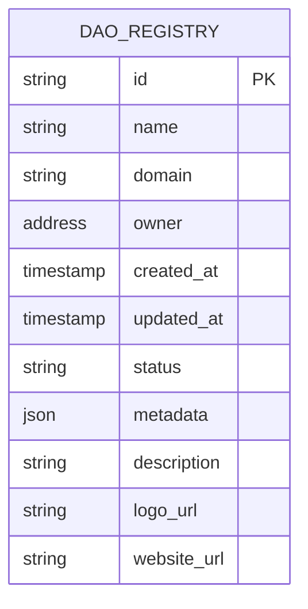

### Reserved Subdomains Entity
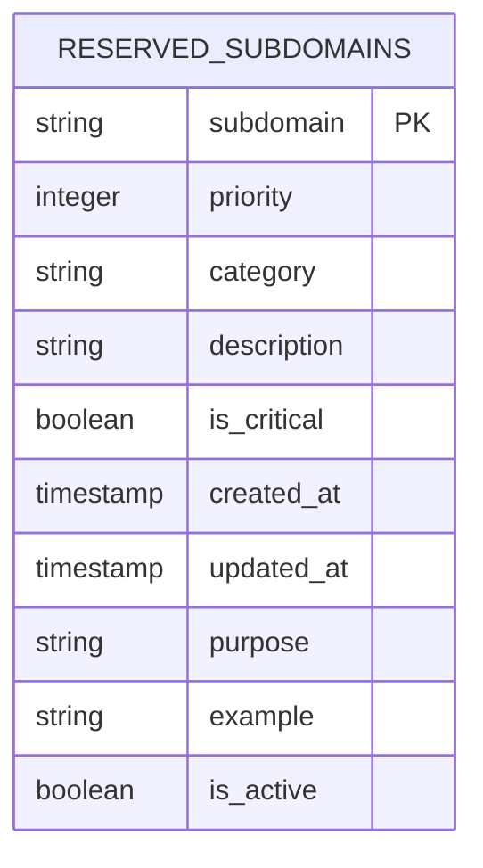

### ENS Domains Entity
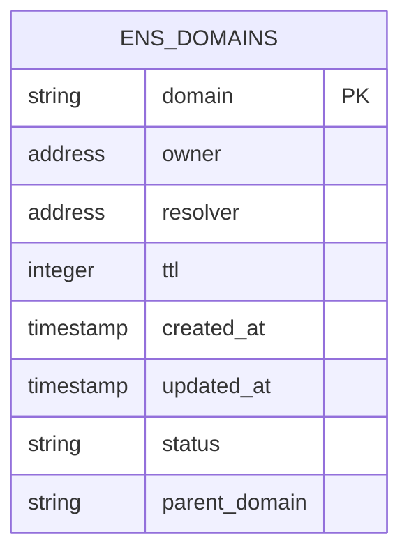

### Validation Rules Entity
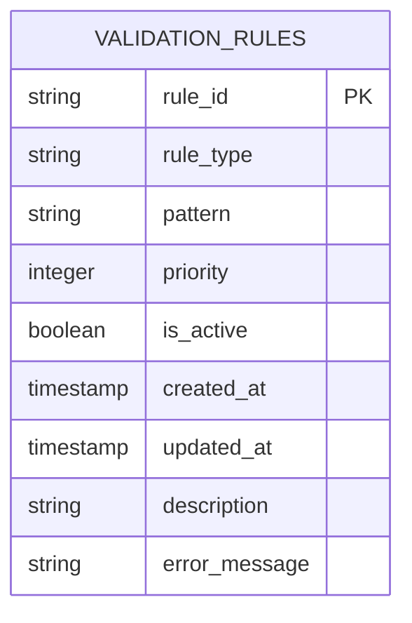

## Subdomain Category Entities

### Core DAO Components
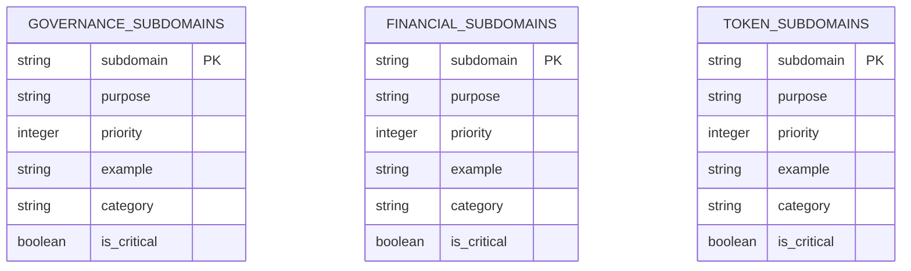

### Documentation & Information
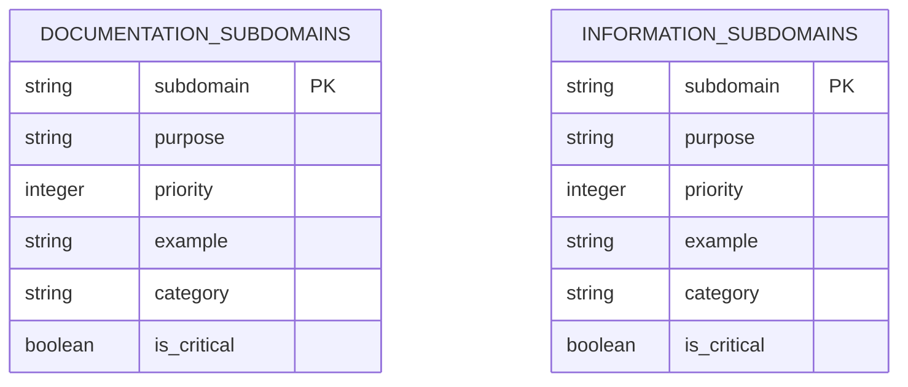

### Community & Communication
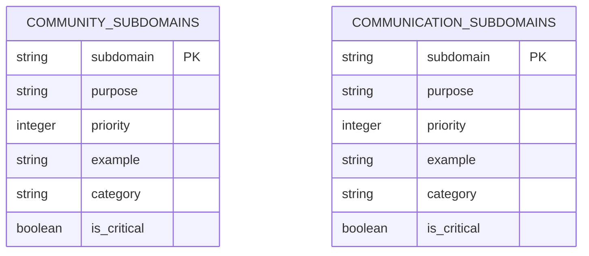

### Analytics & Monitoring
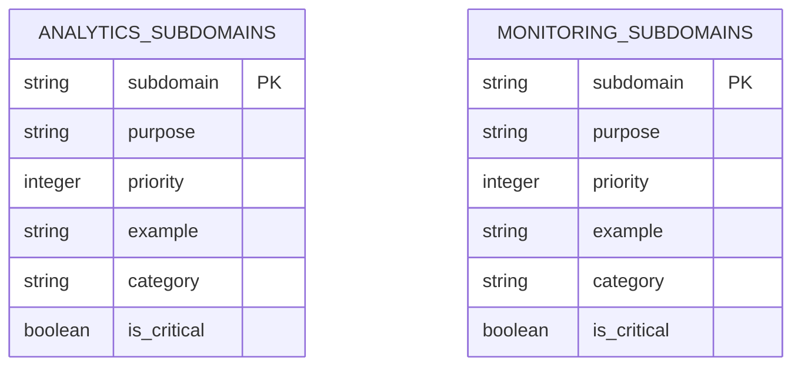

### Development & Technical
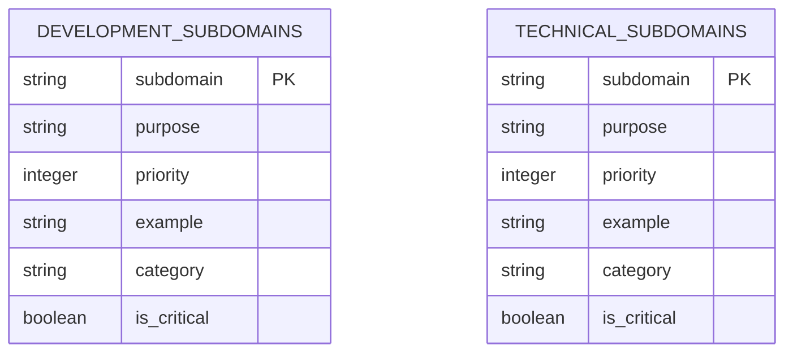

### Governance & Legal
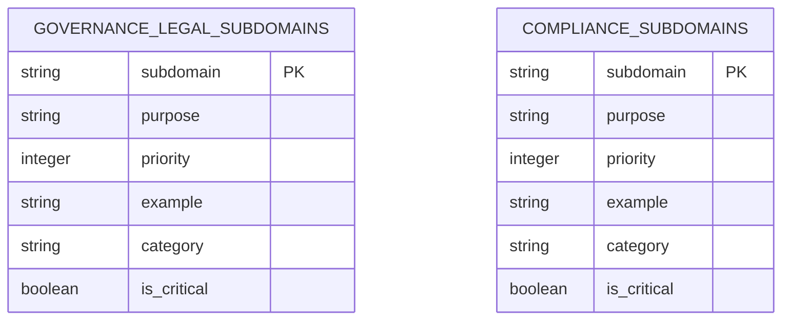

### Marketing & Brand
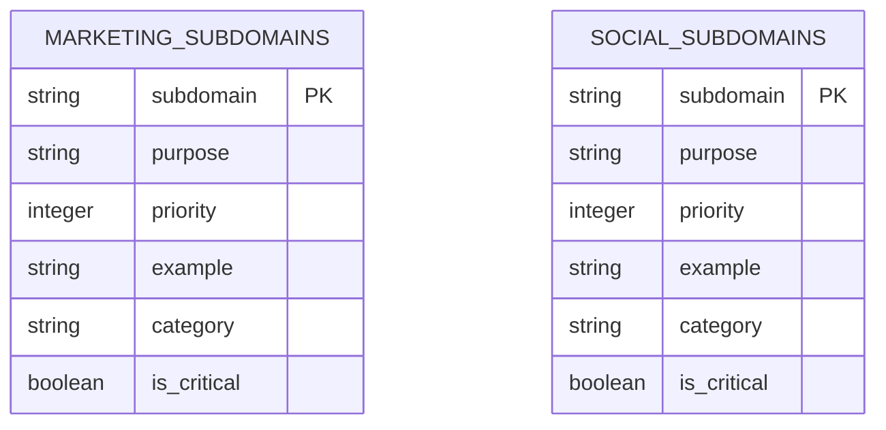

### Administrative
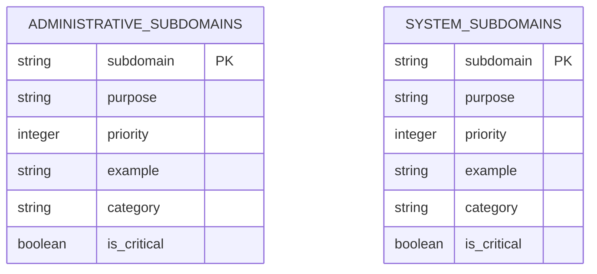

## Priority-Based Entities

### Critical Priority Subdomains
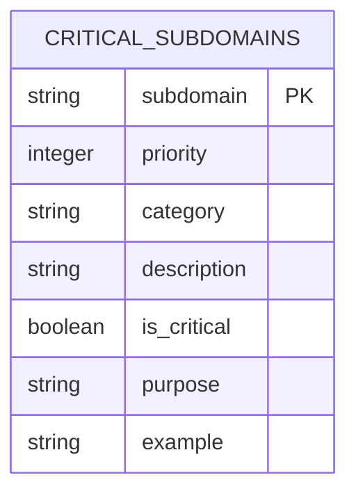

### High Priority Subdomains
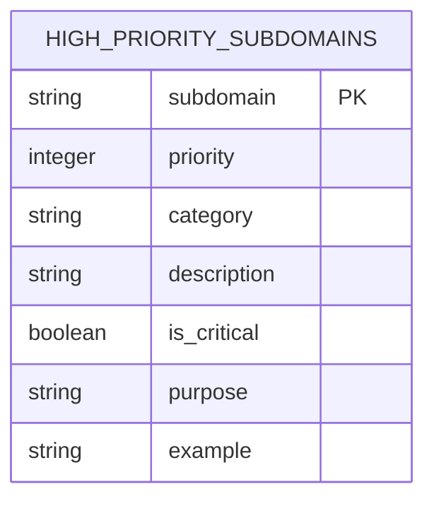

### Medium Priority Subdomains
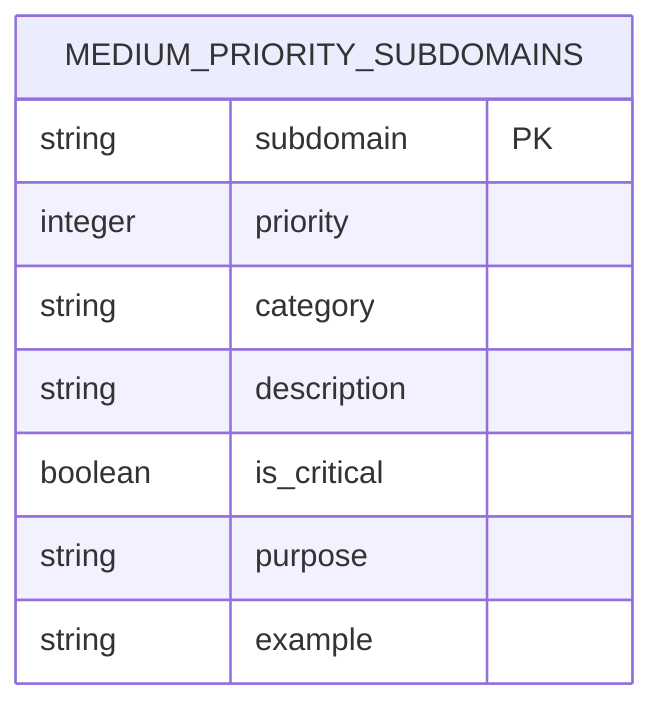

## Validation and Rules Entities

### Validation Rules


### Reserved Word Patterns
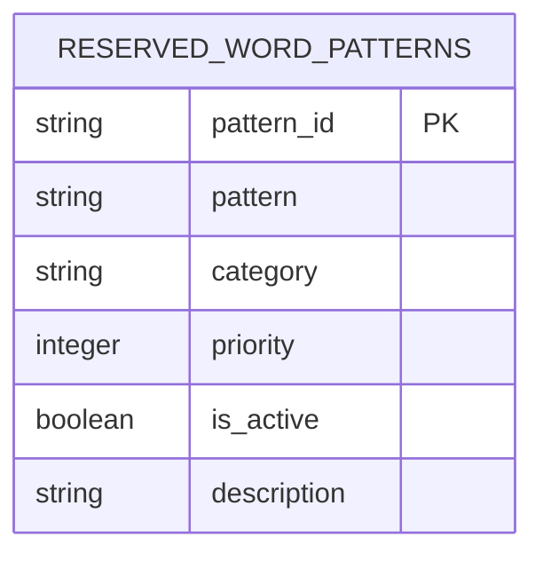

### Validation Results
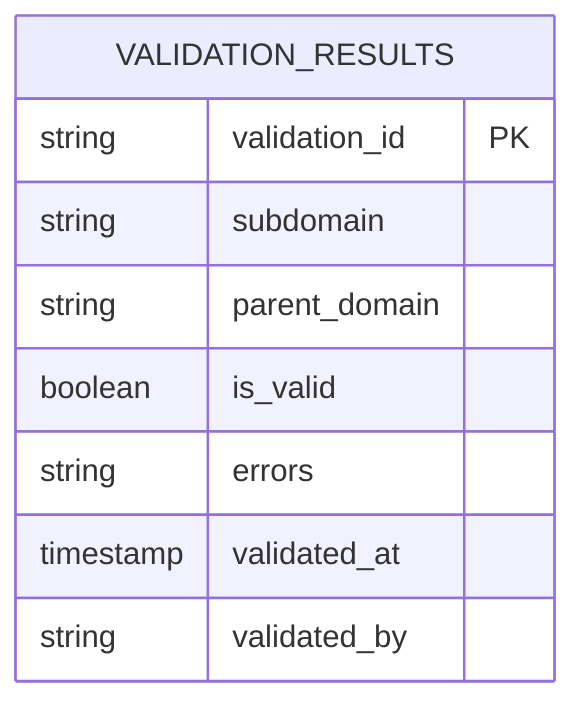

## ENS Integration Entities

### ENS Registry
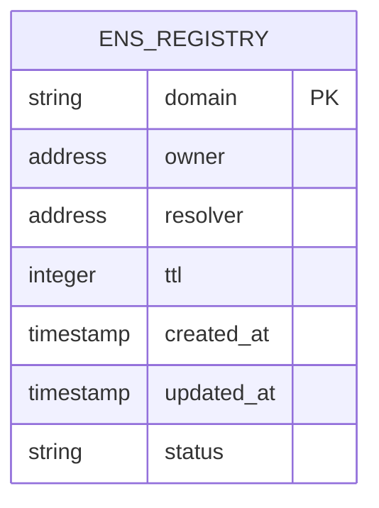

### ENS Resolver
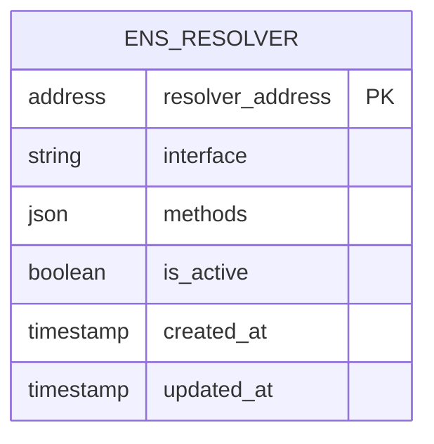

### ENS Domain Ownership
```mermaid
erDiagram
    ENS_DOMAIN_OWNERSHIP {
        string domain PK
        address owner
        timestamp ownership_start
        timestamp ownership_end
        string ownership_type
        boolean is_active
    }
```

## System Management Entities

### Users
```mermaid
erDiagram
    USERS {
        address user_address PK
        string username
        string email
        string role
        timestamp created_at
        timestamp updated_at
        boolean is_active
        json preferences
    }
```

### Permissions
```mermaid
erDiagram
    PERMISSIONS {
        string permission_id PK
        string permission_name
        string description
        string resource
        string action
        boolean is_active
    }
```

### User Permissions
```mermaid
erDiagram
    USER_PERMISSIONS {
        address user_address PK
        string permission_id PK
        timestamp granted_at
        timestamp expires_at
        string granted_by
        boolean is_active
    }
```

### Audit Log
```mermaid
erDiagram
    AUDIT_LOG {
        string log_id PK
        address user_address
        string action
        string resource
        json details
        timestamp created_at
        string ip_address
        string user_agent
    }
```

## Complete ERD

### Main System ERD
```mermaid
erDiagram
    DAO_REGISTRY {
        string id PK
        string name
        string domain
        address owner
        timestamp created_at
        timestamp updated_at
        string status
        json metadata
    }

    RESERVED_SUBDOMAINS {
        string subdomain PK
        integer priority
        string category
        string description
        boolean is_critical
        timestamp created_at
        timestamp updated_at
    }

    ENS_DOMAINS {
        string domain PK
        address owner
        address resolver
        integer ttl
        timestamp created_at
        timestamp updated_at
    }

    VALIDATION_RULES {
        string rule_id PK
        string rule_type
        string pattern
        integer priority
        boolean is_active
        timestamp created_at
        timestamp updated_at
    }

    USERS {
        address user_address PK
        string username
        string email
        string role
        timestamp created_at
        timestamp updated_at
        boolean is_active
    }

    PERMISSIONS {
        string permission_id PK
        string permission_name
        string description
        string resource
        string action
        boolean is_active
    }

    USER_PERMISSIONS {
        address user_address PK
        string permission_id PK
        timestamp granted_at
        timestamp expires_at
        string granted_by
        boolean is_active
    }

    AUDIT_LOG {
        string log_id PK
        address user_address
        string action
        string resource
        json details
        timestamp created_at
        string ip_address
        string user_agent
    }

    VALIDATION_RESULTS {
        string validation_id PK
        string subdomain
        string parent_domain
        boolean is_valid
        string errors
        timestamp validated_at
        string validated_by
    }

    ENS_REGISTRY {
        string domain PK
        address owner
        address resolver
        integer ttl
        timestamp created_at
        timestamp updated_at
        string status
    }

    ENS_RESOLVER {
        address resolver_address PK
        string interface
        json methods
        boolean is_active
        timestamp created_at
        timestamp updated_at
    }

    ENS_DOMAIN_OWNERSHIP {
        string domain PK
        address owner
        timestamp ownership_start
        timestamp ownership_end
        string ownership_type
        boolean is_active
    }

    RESERVED_WORD_PATTERNS {
        string pattern_id PK
        string pattern
        string category
        integer priority
        boolean is_active
        string description
    }

    %% Relationships
    DAO_REGISTRY ||--o{ RESERVED_SUBDOMAINS : "manages"
    DAO_REGISTRY ||--o{ ENS_DOMAINS : "owns"
    DAO_REGISTRY ||--o{ VALIDATION_RESULTS : "validates"
    
    RESERVED_SUBDOMAINS ||--o{ VALIDATION_RULES : "enforces"
    RESERVED_SUBDOMAINS ||--o{ RESERVED_WORD_PATTERNS : "matches"
    
    ENS_DOMAINS ||--o{ ENS_REGISTRY : "registers"
    ENS_DOMAINS ||--o{ ENS_RESOLVER : "resolves"
    ENS_DOMAINS ||--o{ ENS_DOMAIN_OWNERSHIP : "tracks"
    
    USERS ||--o{ USER_PERMISSIONS : "has"
    PERMISSIONS ||--o{ USER_PERMISSIONS : "granted_to"
    USERS ||--o{ AUDIT_LOG : "performs"
    
    VALIDATION_RULES ||--o{ VALIDATION_RESULTS : "produces"
    RESERVED_WORD_PATTERNS ||--o{ VALIDATION_RESULTS : "validates"
```

### Priority-Based ERD
```mermaid
erDiagram
    CRITICAL_SUBDOMAINS {
        string subdomain PK
        integer priority
        string category
        string description
        boolean is_critical
        string purpose
        string example
    }

    HIGH_PRIORITY_SUBDOMAINS {
        string subdomain PK
        integer priority
        string category
        string description
        boolean is_critical
        string purpose
        string example
    }

    MEDIUM_PRIORITY_SUBDOMAINS {
        string subdomain PK
        integer priority
        string category
        string description
        boolean is_critical
        string purpose
        string example
    }

    VALIDATION_RULES {
        string rule_id PK
        string rule_type
        string pattern
        integer priority
        boolean is_active
        timestamp created_at
        timestamp updated_at
        string description
        string error_message
    }

    VALIDATION_RESULTS {
        string validation_id PK
        string subdomain
        string parent_domain
        boolean is_valid
        string errors
        timestamp validated_at
        string validated_by
    }

    %% Priority Relationships
    CRITICAL_SUBDOMAINS ||--o{ VALIDATION_RULES : "enforces_critical"
    HIGH_PRIORITY_SUBDOMAINS ||--o{ VALIDATION_RULES : "enforces_high"
    MEDIUM_PRIORITY_SUBDOMAINS ||--o{ VALIDATION_RULES : "enforces_medium"
    
    VALIDATION_RULES ||--o{ VALIDATION_RESULTS : "produces"
    CRITICAL_SUBDOMAINS ||--o{ VALIDATION_RESULTS : "validates_critical"
    HIGH_PRIORITY_SUBDOMAINS ||--o{ VALIDATION_RESULTS : "validates_high"
    MEDIUM_PRIORITY_SUBDOMAINS ||--o{ VALIDATION_RESULTS : "validates_medium"
```

### Category-Based ERD
```mermaid
erDiagram
    GOVERNANCE_SUBDOMAINS {
        string subdomain PK
        string purpose
        integer priority
        string example
        string category
        boolean is_critical
    }

    FINANCIAL_SUBDOMAINS {
        string subdomain PK
        string purpose
        integer priority
        string example
        string category
        boolean is_critical
    }

    TOKEN_SUBDOMAINS {
        string subdomain PK
        string purpose
        integer priority
        string example
        string category
        boolean is_critical
    }

    DOCUMENTATION_SUBDOMAINS {
        string subdomain PK
        string purpose
        integer priority
        string example
        string category
        boolean is_critical
    }

    INFORMATION_SUBDOMAINS {
        string subdomain PK
        string purpose
        integer priority
        string example
        string category
        boolean is_critical
    }

    COMMUNITY_SUBDOMAINS {
        string subdomain PK
        string purpose
        integer priority
        string example
        string category
        boolean is_critical
    }

    COMMUNICATION_SUBDOMAINS {
        string subdomain PK
        string purpose
        integer priority
        string example
        string category
        boolean is_critical
    }

    ANALYTICS_SUBDOMAINS {
        string subdomain PK
        string purpose
        integer priority
        string example
        string category
        boolean is_critical
    }

    MONITORING_SUBDOMAINS {
        string subdomain PK
        string purpose
        integer priority
        string example
        string category
        boolean is_critical
    }

    DEVELOPMENT_SUBDOMAINS {
        string subdomain PK
        string purpose
        integer priority
        string example
        string category
        boolean is_critical
    }

    TECHNICAL_SUBDOMAINS {
        string subdomain PK
        string purpose
        integer priority
        string example
        string category
        boolean is_critical
    }

    GOVERNANCE_LEGAL_SUBDOMAINS {
        string subdomain PK
        string purpose
        integer priority
        string example
        string category
        boolean is_critical
    }

    COMPLIANCE_SUBDOMAINS {
        string subdomain PK
        string purpose
        integer priority
        string example
        string category
        boolean is_critical
    }

    MARKETING_SUBDOMAINS {
        string subdomain PK
        string purpose
        integer priority
        string example
        string category
        boolean is_critical
    }

    SOCIAL_SUBDOMAINS {
        string subdomain PK
        string purpose
        integer priority
        string example
        string category
        boolean is_critical
    }

    ADMINISTRATIVE_SUBDOMAINS {
        string subdomain PK
        string purpose
        integer priority
        string example
        string category
        boolean is_critical
    }

    SYSTEM_SUBDOMAINS {
        string subdomain PK
        string purpose
        integer priority
        string example
        string category
        boolean is_critical
    }

    DAO_REGISTRY {
        string id PK
        string name
        string domain
        address owner
        timestamp created_at
        timestamp updated_at
        string status
        json metadata
    }

    VALIDATION_RULES {
        string rule_id PK
        string rule_type
        string pattern
        integer priority
        boolean is_active
        timestamp created_at
        timestamp updated_at
        string description
        string error_message
    }

    %% Category Relationships
    DAO_REGISTRY ||--o{ GOVERNANCE_SUBDOMAINS : "manages_governance"
    DAO_REGISTRY ||--o{ FINANCIAL_SUBDOMAINS : "manages_financial"
    DAO_REGISTRY ||--o{ TOKEN_SUBDOMAINS : "manages_token"
    DAO_REGISTRY ||--o{ DOCUMENTATION_SUBDOMAINS : "manages_documentation"
    DAO_REGISTRY ||--o{ INFORMATION_SUBDOMAINS : "manages_information"
    DAO_REGISTRY ||--o{ COMMUNITY_SUBDOMAINS : "manages_community"
    DAO_REGISTRY ||--o{ COMMUNICATION_SUBDOMAINS : "manages_communication"
    DAO_REGISTRY ||--o{ ANALYTICS_SUBDOMAINS : "manages_analytics"
    DAO_REGISTRY ||--o{ MONITORING_SUBDOMAINS : "manages_monitoring"
    DAO_REGISTRY ||--o{ DEVELOPMENT_SUBDOMAINS : "manages_development"
    DAO_REGISTRY ||--o{ TECHNICAL_SUBDOMAINS : "manages_technical"
    DAO_REGISTRY ||--o{ GOVERNANCE_LEGAL_SUBDOMAINS : "manages_governance_legal"
    DAO_REGISTRY ||--o{ COMPLIANCE_SUBDOMAINS : "manages_compliance"
    DAO_REGISTRY ||--o{ MARKETING_SUBDOMAINS : "manages_marketing"
    DAO_REGISTRY ||--o{ SOCIAL_SUBDOMAINS : "manages_social"
    DAO_REGISTRY ||--o{ ADMINISTRATIVE_SUBDOMAINS : "manages_administrative"
    DAO_REGISTRY ||--o{ SYSTEM_SUBDOMAINS : "manages_system"
    
    VALIDATION_RULES ||--o{ GOVERNANCE_SUBDOMAINS : "validates_governance"
    VALIDATION_RULES ||--o{ FINANCIAL_SUBDOMAINS : "validates_financial"
    VALIDATION_RULES ||--o{ TOKEN_SUBDOMAINS : "validates_token"
    VALIDATION_RULES ||--o{ DOCUMENTATION_SUBDOMAINS : "validates_documentation"
    VALIDATION_RULES ||--o{ INFORMATION_SUBDOMAINS : "validates_information"
    VALIDATION_RULES ||--o{ COMMUNITY_SUBDOMAINS : "validates_community"
    VALIDATION_RULES ||--o{ COMMUNICATION_SUBDOMAINS : "validates_communication"
    VALIDATION_RULES ||--o{ ANALYTICS_SUBDOMAINS : "validates_analytics"
    VALIDATION_RULES ||--o{ MONITORING_SUBDOMAINS : "validates_monitoring"
    VALIDATION_RULES ||--o{ DEVELOPMENT_SUBDOMAINS : "validates_development"
    VALIDATION_RULES ||--o{ TECHNICAL_SUBDOMAINS : "validates_technical"
    VALIDATION_RULES ||--o{ GOVERNANCE_LEGAL_SUBDOMAINS : "validates_governance_legal"
    VALIDATION_RULES ||--o{ COMPLIANCE_SUBDOMAINS : "validates_compliance"
    VALIDATION_RULES ||--o{ MARKETING_SUBDOMAINS : "validates_marketing"
    VALIDATION_RULES ||--o{ SOCIAL_SUBDOMAINS : "validates_social"
    VALIDATION_RULES ||--o{ ADMINISTRATIVE_SUBDOMAINS : "validates_administrative"
    VALIDATION_RULES ||--o{ SYSTEM_SUBDOMAINS : "validates_system"
```

## Database Schema

### Core Tables

#### dao_registry
```sql
CREATE TABLE dao_registry (
    id VARCHAR(255) PRIMARY KEY,
    name VARCHAR(255) NOT NULL,
    domain VARCHAR(255) NOT NULL UNIQUE,
    owner ADDRESS NOT NULL,
    created_at TIMESTAMP DEFAULT CURRENT_TIMESTAMP,
    updated_at TIMESTAMP DEFAULT CURRENT_TIMESTAMP ON UPDATE CURRENT_TIMESTAMP,
    status VARCHAR(50) DEFAULT 'active',
    metadata JSON,
    description TEXT,
    logo_url VARCHAR(500),
    website_url VARCHAR(500)
);
```

#### reserved_subdomains
```sql
CREATE TABLE reserved_subdomains (
    subdomain VARCHAR(255) PRIMARY KEY,
    priority INTEGER NOT NULL DEFAULT 3,
    category VARCHAR(100) NOT NULL,
    description TEXT,
    is_critical BOOLEAN DEFAULT FALSE,
    created_at TIMESTAMP DEFAULT CURRENT_TIMESTAMP,
    updated_at TIMESTAMP DEFAULT CURRENT_TIMESTAMP ON UPDATE CURRENT_TIMESTAMP,
    purpose VARCHAR(255),
    example VARCHAR(255),
    is_active BOOLEAN DEFAULT TRUE
);
```

#### ens_domains
```sql
CREATE TABLE ens_domains (
    domain VARCHAR(255) PRIMARY KEY,
    owner ADDRESS NOT NULL,
    resolver ADDRESS,
    ttl INTEGER DEFAULT 0,
    created_at TIMESTAMP DEFAULT CURRENT_TIMESTAMP,
    updated_at TIMESTAMP DEFAULT CURRENT_TIMESTAMP ON UPDATE CURRENT_TIMESTAMP,
    status VARCHAR(50) DEFAULT 'active',
    parent_domain VARCHAR(255)
);
```

#### validation_rules
```sql
CREATE TABLE validation_rules (
    rule_id VARCHAR(255) PRIMARY KEY,
    rule_type VARCHAR(100) NOT NULL,
    pattern VARCHAR(500) NOT NULL,
    priority INTEGER NOT NULL DEFAULT 1,
    is_active BOOLEAN DEFAULT TRUE,
    created_at TIMESTAMP DEFAULT CURRENT_TIMESTAMP,
    updated_at TIMESTAMP DEFAULT CURRENT_TIMESTAMP ON UPDATE CURRENT_TIMESTAMP,
    description TEXT,
    error_message VARCHAR(500)
);
```

### Priority-Based Tables

#### critical_subdomains
```sql
CREATE TABLE critical_subdomains (
    subdomain VARCHAR(255) PRIMARY KEY,
    priority INTEGER NOT NULL DEFAULT 1,
    category VARCHAR(100) NOT NULL,
    description TEXT,
    is_critical BOOLEAN DEFAULT TRUE,
    purpose VARCHAR(255),
    example VARCHAR(255),
    created_at TIMESTAMP DEFAULT CURRENT_TIMESTAMP,
    updated_at TIMESTAMP DEFAULT CURRENT_TIMESTAMP ON UPDATE CURRENT_TIMESTAMP
);
```

#### high_priority_subdomains
```sql
CREATE TABLE high_priority_subdomains (
    subdomain VARCHAR(255) PRIMARY KEY,
    priority INTEGER NOT NULL DEFAULT 2,
    category VARCHAR(100) NOT NULL,
    description TEXT,
    is_critical BOOLEAN DEFAULT FALSE,
    purpose VARCHAR(255),
    example VARCHAR(255),
    created_at TIMESTAMP DEFAULT CURRENT_TIMESTAMP,
    updated_at TIMESTAMP DEFAULT CURRENT_TIMESTAMP ON UPDATE CURRENT_TIMESTAMP
);
```

#### medium_priority_subdomains
```sql
CREATE TABLE medium_priority_subdomains (
    subdomain VARCHAR(255) PRIMARY KEY,
    priority INTEGER NOT NULL DEFAULT 3,
    category VARCHAR(100) NOT NULL,
    description TEXT,
    is_critical BOOLEAN DEFAULT FALSE,
    purpose VARCHAR(255),
    example VARCHAR(255),
    created_at TIMESTAMP DEFAULT CURRENT_TIMESTAMP,
    updated_at TIMESTAMP DEFAULT CURRENT_TIMESTAMP ON UPDATE CURRENT_TIMESTAMP
);
```

### Category-Based Tables

#### governance_subdomains
```sql
CREATE TABLE governance_subdomains (
    subdomain VARCHAR(255) PRIMARY KEY,
    purpose VARCHAR(255) NOT NULL,
    priority INTEGER NOT NULL,
    example VARCHAR(255),
    category VARCHAR(100) DEFAULT 'governance',
    is_critical BOOLEAN DEFAULT FALSE,
    created_at TIMESTAMP DEFAULT CURRENT_TIMESTAMP,
    updated_at TIMESTAMP DEFAULT CURRENT_TIMESTAMP ON UPDATE CURRENT_TIMESTAMP
);
```

#### financial_subdomains
```sql
CREATE TABLE financial_subdomains (
    subdomain VARCHAR(255) PRIMARY KEY,
    purpose VARCHAR(255) NOT NULL,
    priority INTEGER NOT NULL,
    example VARCHAR(255),
    category VARCHAR(100) DEFAULT 'financial',
    is_critical BOOLEAN DEFAULT FALSE,
    created_at TIMESTAMP DEFAULT CURRENT_TIMESTAMP,
    updated_at TIMESTAMP DEFAULT CURRENT_TIMESTAMP ON UPDATE CURRENT_TIMESTAMP
);
```

#### token_subdomains
```sql
CREATE TABLE token_subdomains (
    subdomain VARCHAR(255) PRIMARY KEY,
    purpose VARCHAR(255) NOT NULL,
    priority INTEGER NOT NULL,
    example VARCHAR(255),
    category VARCHAR(100) DEFAULT 'token',
    is_critical BOOLEAN DEFAULT FALSE,
    created_at TIMESTAMP DEFAULT CURRENT_TIMESTAMP,
    updated_at TIMESTAMP DEFAULT CURRENT_TIMESTAMP ON UPDATE CURRENT_TIMESTAMP
);
```

### System Management Tables

#### users
```sql
CREATE TABLE users (
    user_address ADDRESS PRIMARY KEY,
    username VARCHAR(255) UNIQUE,
    email VARCHAR(255) UNIQUE,
    role VARCHAR(50) DEFAULT 'user',
    created_at TIMESTAMP DEFAULT CURRENT_TIMESTAMP,
    updated_at TIMESTAMP DEFAULT CURRENT_TIMESTAMP ON UPDATE CURRENT_TIMESTAMP,
    is_active BOOLEAN DEFAULT TRUE,
    preferences JSON
);
```

#### permissions
```sql
CREATE TABLE permissions (
    permission_id VARCHAR(255) PRIMARY KEY,
    permission_name VARCHAR(255) NOT NULL UNIQUE,
    description TEXT,
    resource VARCHAR(255) NOT NULL,
    action VARCHAR(100) NOT NULL,
    is_active BOOLEAN DEFAULT TRUE,
    created_at TIMESTAMP DEFAULT CURRENT_TIMESTAMP,
    updated_at TIMESTAMP DEFAULT CURRENT_TIMESTAMP ON UPDATE CURRENT_TIMESTAMP
);
```

#### user_permissions
```sql
CREATE TABLE user_permissions (
    user_address ADDRESS,
    permission_id VARCHAR(255),
    granted_at TIMESTAMP DEFAULT CURRENT_TIMESTAMP,
    expires_at TIMESTAMP NULL,
    granted_by ADDRESS,
    is_active BOOLEAN DEFAULT TRUE,
    PRIMARY KEY (user_address, permission_id),
    FOREIGN KEY (user_address) REFERENCES users(user_address),
    FOREIGN KEY (permission_id) REFERENCES permissions(permission_id)
);
```

#### audit_log
```sql
CREATE TABLE audit_log (
    log_id VARCHAR(255) PRIMARY KEY,
    user_address ADDRESS,
    action VARCHAR(255) NOT NULL,
    resource VARCHAR(255) NOT NULL,
    details JSON,
    created_at TIMESTAMP DEFAULT CURRENT_TIMESTAMP,
    ip_address VARCHAR(45),
    user_agent TEXT,
    FOREIGN KEY (user_address) REFERENCES users(user_address)
);
```

### Validation Tables

#### validation_results
```sql
CREATE TABLE validation_results (
    validation_id VARCHAR(255) PRIMARY KEY,
    subdomain VARCHAR(255) NOT NULL,
    parent_domain VARCHAR(255) NOT NULL,
    is_valid BOOLEAN NOT NULL,
    errors TEXT,
    validated_at TIMESTAMP DEFAULT CURRENT_TIMESTAMP,
    validated_by ADDRESS,
    FOREIGN KEY (validated_by) REFERENCES users(user_address)
);
```

#### reserved_word_patterns
```sql
CREATE TABLE reserved_word_patterns (
    pattern_id VARCHAR(255) PRIMARY KEY,
    pattern VARCHAR(500) NOT NULL,
    category VARCHAR(100) NOT NULL,
    priority INTEGER NOT NULL DEFAULT 1,
    is_active BOOLEAN DEFAULT TRUE,
    description TEXT,
    created_at TIMESTAMP DEFAULT CURRENT_TIMESTAMP,
    updated_at TIMESTAMP DEFAULT CURRENT_TIMESTAMP ON UPDATE CURRENT_TIMESTAMP
);
```

### ENS Integration Tables

#### ens_registry
```sql
CREATE TABLE ens_registry (
    domain VARCHAR(255) PRIMARY KEY,
    owner ADDRESS NOT NULL,
    resolver ADDRESS,
    ttl INTEGER DEFAULT 0,
    created_at TIMESTAMP DEFAULT CURRENT_TIMESTAMP,
    updated_at TIMESTAMP DEFAULT CURRENT_TIMESTAMP ON UPDATE CURRENT_TIMESTAMP,
    status VARCHAR(50) DEFAULT 'active'
);
```

#### ens_resolver
```sql
CREATE TABLE ens_resolver (
    resolver_address ADDRESS PRIMARY KEY,
    interface VARCHAR(255) NOT NULL,
    methods JSON,
    is_active BOOLEAN DEFAULT TRUE,
    created_at TIMESTAMP DEFAULT CURRENT_TIMESTAMP,
    updated_at TIMESTAMP DEFAULT CURRENT_TIMESTAMP ON UPDATE CURRENT_TIMESTAMP
);
```

#### ens_domain_ownership
```sql
CREATE TABLE ens_domain_ownership (
    domain VARCHAR(255),
    owner ADDRESS NOT NULL,
    ownership_start TIMESTAMP DEFAULT CURRENT_TIMESTAMP,
    ownership_end TIMESTAMP NULL,
    ownership_type VARCHAR(50) DEFAULT 'permanent',
    is_active BOOLEAN DEFAULT TRUE,
    PRIMARY KEY (domain, owner),
    FOREIGN KEY (domain) REFERENCES ens_registry(domain)
);
```

This ERD specification provides a comprehensive database design for the reserved subdomains system, with proper relationships, cardinality, and data modeling that accurately represents the system architecture and relationships. 