# Reserved Subdomains Visual ERD Specification

## Overview

This specification defines the visual Entity Relationship Diagram (ERD) for the DAO Registry reserved subdomains system. The visual ERD provides clear diagrammatic representation of entities, their attributes, and relationships for creating visual diagrams.

## Table of Contents

1. [Visual Entity Definitions](#visual-entity-definitions)
2. [Relationship Visualizations](#relationship-visualizations)
3. [Priority-Based Visual ERD](#priority-based-visual-erd)
4. [Category-Based Visual ERD](#category-based-visual-erd)
5. [System Architecture Visual ERD](#system-architecture-visual-erd)
6. [Complete Visual ERD](#complete-visual-erd)

## Visual Entity Definitions

### Core Entities with Visual Attributes

#### DAO Registry Entity
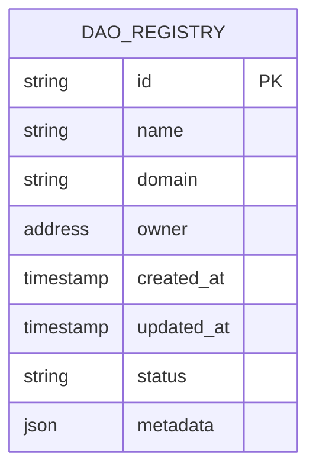

#### Reserved Subdomains Entity
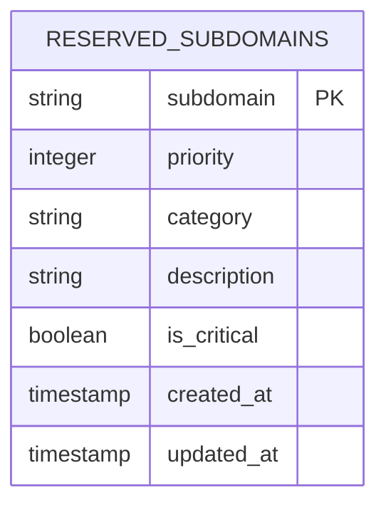

#### ENS Domains Entity
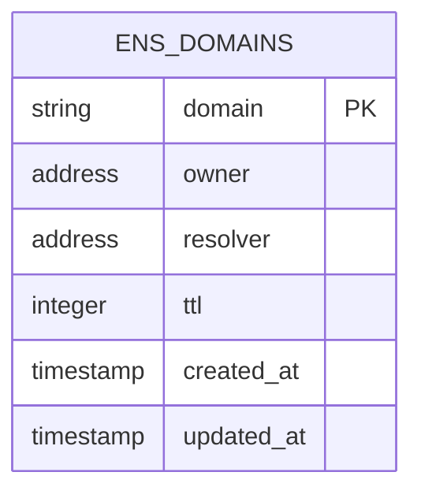

#### Validation Rules Entity
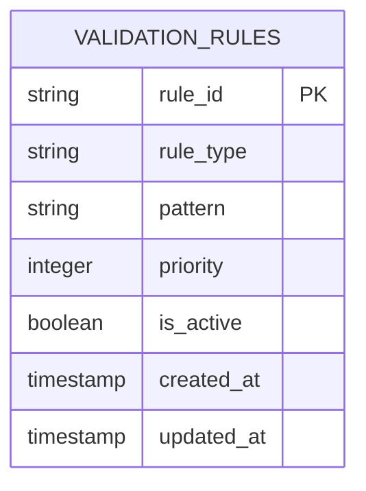

### Priority-Based Visual Entities

#### Critical Priority Entity
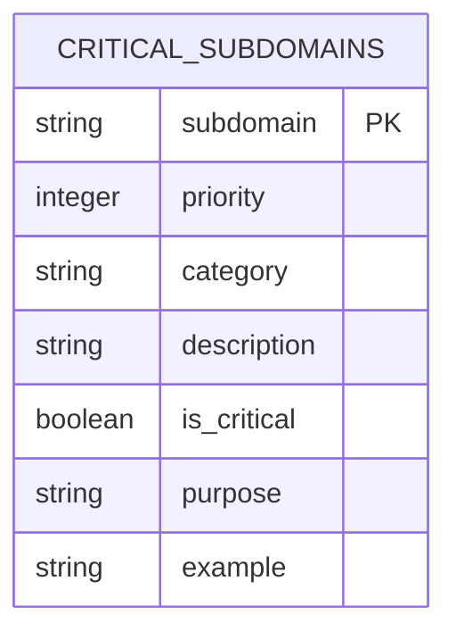

#### High Priority Entity
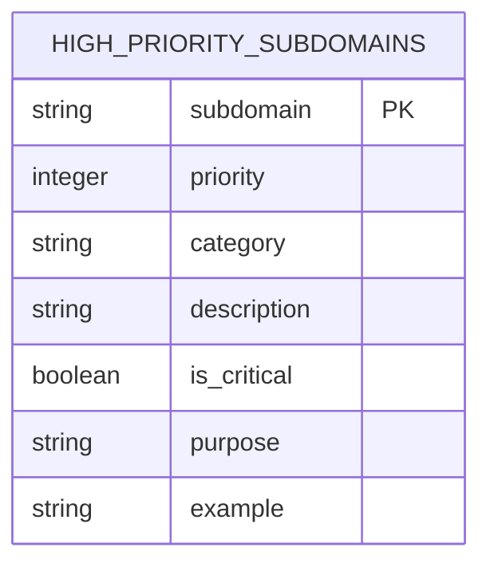

#### Medium Priority Entity
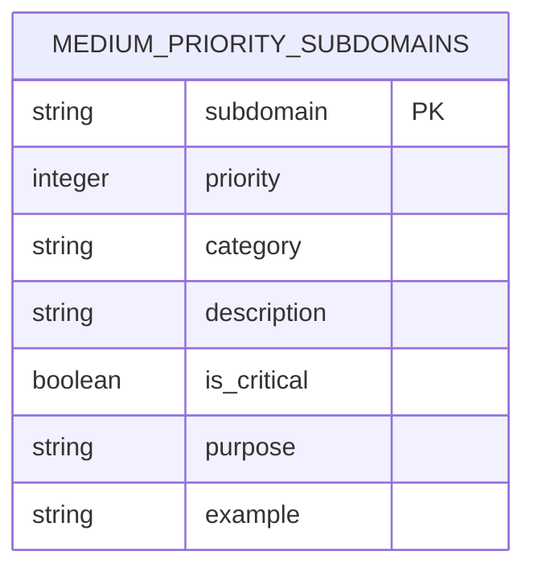

### Category-Based Visual Entities

#### Core DAO Components
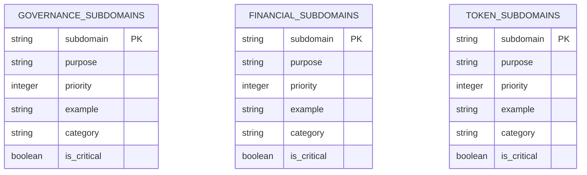

#### Documentation & Information
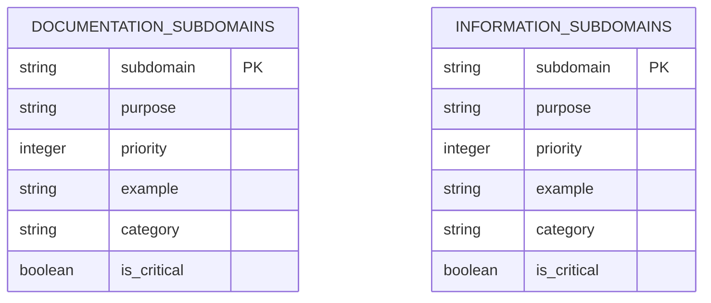

#### Community & Communication
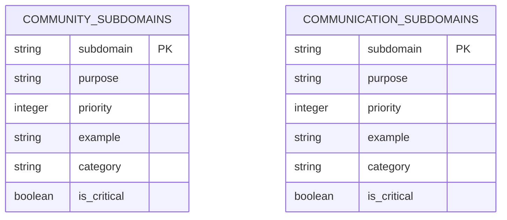

#### Analytics & Monitoring
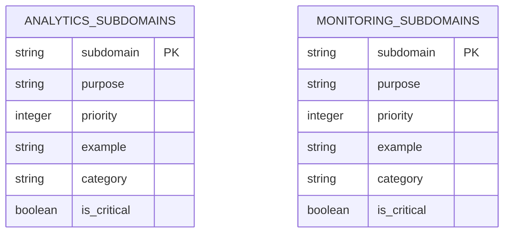

#### Development & Technical
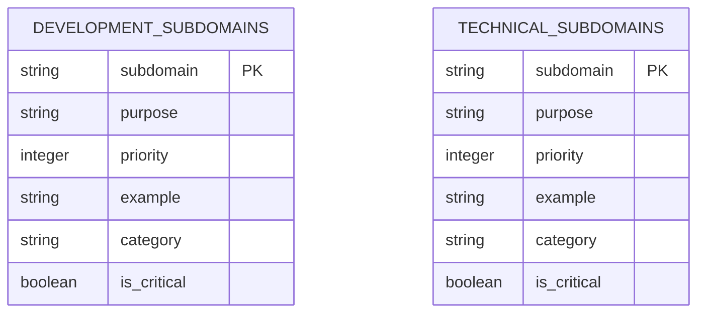

#### Governance & Legal
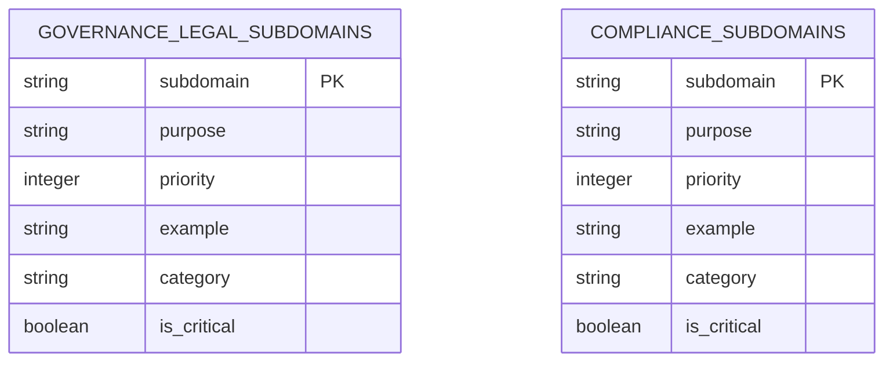

#### Marketing & Brand
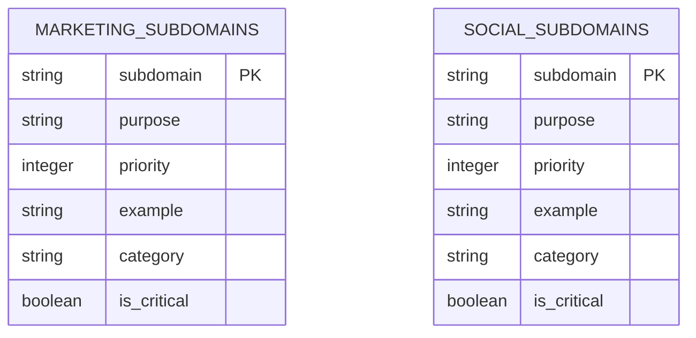

#### Administrative
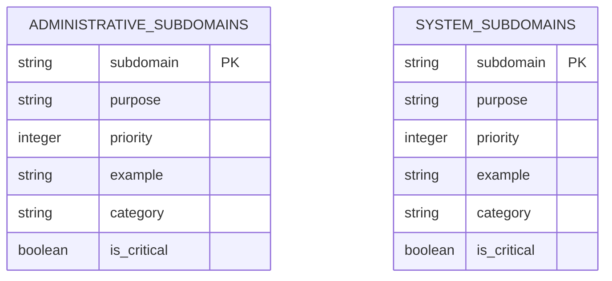

## Relationship Visualizations

### Primary Relationships

#### One-to-Many Relationships
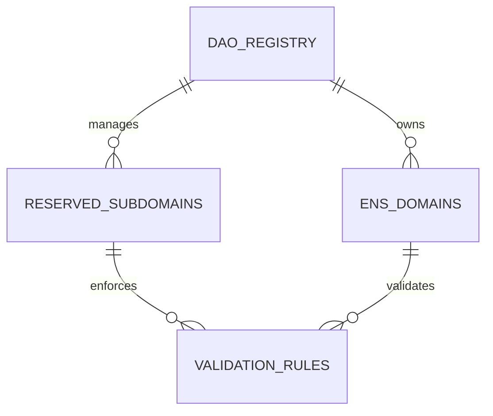

#### Many-to-Many Relationships
```mermaid
erDiagram
    DAO_REGISTRY }o--o{ GOVERNANCE_SUBDOMAINS : "manages_governance"
    DAO_REGISTRY }o--o{ FINANCIAL_SUBDOMAINS : "manages_financial"
    DAO_REGISTRY }o--o{ TOKEN_SUBDOMAINS : "manages_token"
    DAO_REGISTRY }o--o{ DOCUMENTATION_SUBDOMAINS : "manages_documentation"
    DAO_REGISTRY }o--o{ INFORMATION_SUBDOMAINS : "manages_information"
    DAO_REGISTRY }o--o{ COMMUNITY_SUBDOMAINS : "manages_community"
    DAO_REGISTRY }o--o{ COMMUNICATION_SUBDOMAINS : "manages_communication"
    DAO_REGISTRY }o--o{ ANALYTICS_SUBDOMAINS : "manages_analytics"
    DAO_REGISTRY }o--o{ MONITORING_SUBDOMAINS : "manages_monitoring"
    DAO_REGISTRY }o--o{ DEVELOPMENT_SUBDOMAINS : "manages_development"
    DAO_REGISTRY }o--o{ TECHNICAL_SUBDOMAINS : "manages_technical"
    DAO_REGISTRY }o--o{ GOVERNANCE_LEGAL_SUBDOMAINS : "manages_governance_legal"
    DAO_REGISTRY }o--o{ COMPLIANCE_SUBDOMAINS : "manages_compliance"
    DAO_REGISTRY }o--o{ MARKETING_SUBDOMAINS : "manages_marketing"
    DAO_REGISTRY }o--o{ SOCIAL_SUBDOMAINS : "manages_social"
    DAO_REGISTRY }o--o{ ADMINISTRATIVE_SUBDOMAINS : "manages_administrative"
    DAO_REGISTRY }o--o{ SYSTEM_SUBDOMAINS : "manages_system"
```

#### One-to-One Relationships
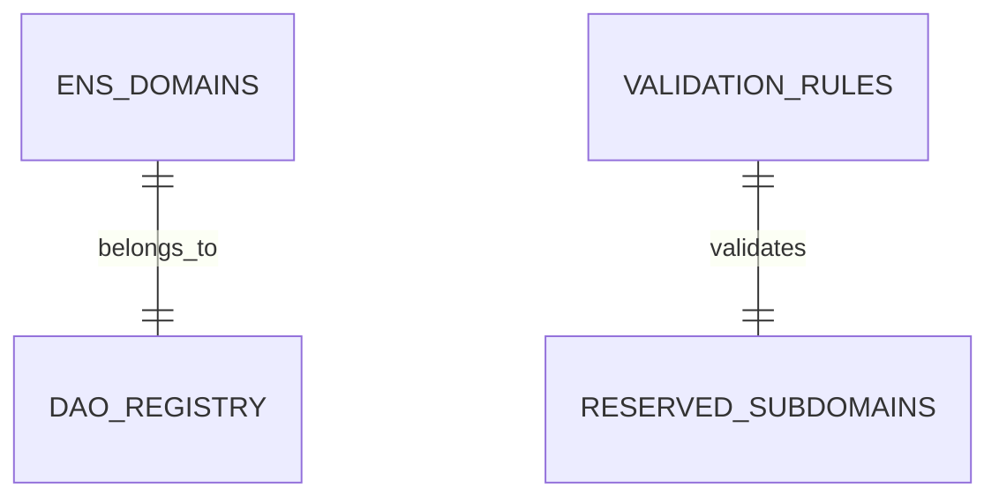

### Priority-Based Relationships

#### Critical Priority Relationships
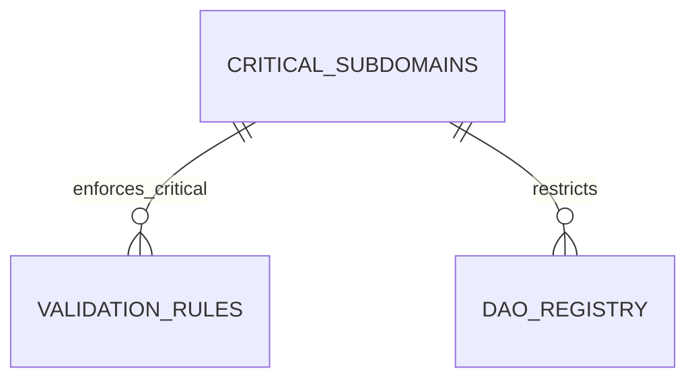

#### High Priority Relationships
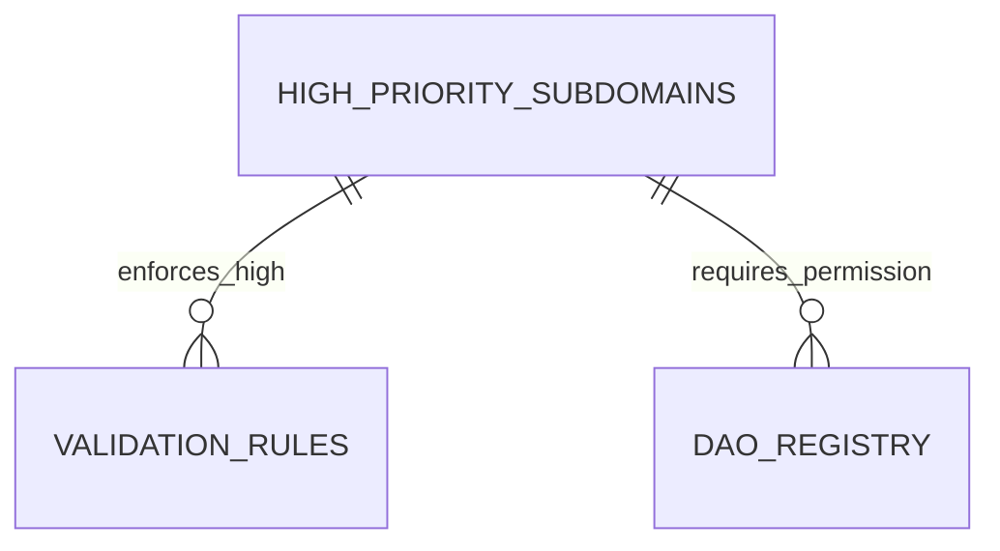

#### Medium Priority Relationships
```mermaid
erDiagram
    MEDIUM_PRIORITY_SUBDOMAINS ||--o{ VALIDATION_RULES : "enforces_medium"
    MEDIUM_PRIORITY_SUBDOMAINS ||--o{ DAO_REGISTRY : "allows_registration"
```

## Priority-Based Visual ERD

### Complete Priority Hierarchy
```mermaid
erDiagram
    CRITICAL_SUBDOMAINS {
        string subdomain PK
        integer priority
        string category
        string description
        boolean is_critical
        string purpose
        string example
    }

    HIGH_PRIORITY_SUBDOMAINS {
        string subdomain PK
        integer priority
        string category
        string description
        boolean is_critical
        string purpose
        string example
    }

    MEDIUM_PRIORITY_SUBDOMAINS {
        string subdomain PK
        integer priority
        string category
        string description
        boolean is_critical
        string purpose
        string example
    }

    VALIDATION_RULES {
        string rule_id PK
        string rule_type
        string pattern
        integer priority
        boolean is_active
        timestamp created_at
        timestamp updated_at
        string description
        string error_message
    }

    VALIDATION_RESULTS {
        string validation_id PK
        string subdomain
        string parent_domain
        boolean is_valid
        string errors
        timestamp validated_at
        string validated_by
    }

    DAO_REGISTRY {
        string id PK
        string name
        string domain
        address owner
        timestamp created_at
        timestamp updated_at
        string status
        json metadata
    }

    %% Priority Relationships
    CRITICAL_SUBDOMAINS ||--o{ VALIDATION_RULES : "enforces_critical"
    HIGH_PRIORITY_SUBDOMAINS ||--o{ VALIDATION_RULES : "enforces_high"
    MEDIUM_PRIORITY_SUBDOMAINS ||--o{ VALIDATION_RULES : "enforces_medium"
    
    VALIDATION_RULES ||--o{ VALIDATION_RESULTS : "produces"
    CRITICAL_SUBDOMAINS ||--o{ VALIDATION_RESULTS : "validates_critical"
    HIGH_PRIORITY_SUBDOMAINS ||--o{ VALIDATION_RESULTS : "validates_high"
    MEDIUM_PRIORITY_SUBDOMAINS ||--o{ VALIDATION_RESULTS : "validates_medium"
    
    DAO_REGISTRY ||--o{ CRITICAL_SUBDOMAINS : "restricts"
    DAO_REGISTRY ||--o{ HIGH_PRIORITY_SUBDOMAINS : "requires_permission"
    DAO_REGISTRY ||--o{ MEDIUM_PRIORITY_SUBDOMAINS : "allows_registration"
```

## Category-Based Visual ERD

### Complete Category System
```mermaid
erDiagram
    GOVERNANCE_SUBDOMAINS {
        string subdomain PK
        string purpose
        integer priority
        string example
        string category
        boolean is_critical
    }

    FINANCIAL_SUBDOMAINS {
        string subdomain PK
        string purpose
        integer priority
        string example
        string category
        boolean is_critical
    }

    TOKEN_SUBDOMAINS {
        string subdomain PK
        string purpose
        integer priority
        string example
        string category
        boolean is_critical
    }

    DOCUMENTATION_SUBDOMAINS {
        string subdomain PK
        string purpose
        integer priority
        string example
        string category
        boolean is_critical
    }

    INFORMATION_SUBDOMAINS {
        string subdomain PK
        string purpose
        integer priority
        string example
        string category
        boolean is_critical
    }

    COMMUNITY_SUBDOMAINS {
        string subdomain PK
        string purpose
        integer priority
        string example
        string category
        boolean is_critical
    }

    COMMUNICATION_SUBDOMAINS {
        string subdomain PK
        string purpose
        integer priority
        string example
        string category
        boolean is_critical
    }

    ANALYTICS_SUBDOMAINS {
        string subdomain PK
        string purpose
        integer priority
        string example
        string category
        boolean is_critical
    }

    MONITORING_SUBDOMAINS {
        string subdomain PK
        string purpose
        integer priority
        string example
        string category
        boolean is_critical
    }

    DEVELOPMENT_SUBDOMAINS {
        string subdomain PK
        string purpose
        integer priority
        string example
        string category
        boolean is_critical
    }

    TECHNICAL_SUBDOMAINS {
        string subdomain PK
        string purpose
        integer priority
        string example
        string category
        boolean is_critical
    }

    GOVERNANCE_LEGAL_SUBDOMAINS {
        string subdomain PK
        string purpose
        integer priority
        string example
        string category
        boolean is_critical
    }

    COMPLIANCE_SUBDOMAINS {
        string subdomain PK
        string purpose
        integer priority
        string example
        string category
        boolean is_critical
    }

    MARKETING_SUBDOMAINS {
        string subdomain PK
        string purpose
        integer priority
        string example
        string category
        boolean is_critical
    }

    SOCIAL_SUBDOMAINS {
        string subdomain PK
        string purpose
        integer priority
        string example
        string category
        boolean is_critical
    }

    ADMINISTRATIVE_SUBDOMAINS {
        string subdomain PK
        string purpose
        integer priority
        string example
        string category
        boolean is_critical
    }

    SYSTEM_SUBDOMAINS {
        string subdomain PK
        string purpose
        integer priority
        string example
        string category
        boolean is_critical
    }

    DAO_REGISTRY {
        string id PK
        string name
        string domain
        address owner
        timestamp created_at
        timestamp updated_at
        string status
        json metadata
    }

    VALIDATION_RULES {
        string rule_id PK
        string rule_type
        string pattern
        integer priority
        boolean is_active
        timestamp created_at
        timestamp updated_at
        string description
        string error_message
    }

    %% Category Relationships
    DAO_REGISTRY ||--o{ GOVERNANCE_SUBDOMAINS : "manages_governance"
    DAO_REGISTRY ||--o{ FINANCIAL_SUBDOMAINS : "manages_financial"
    DAO_REGISTRY ||--o{ TOKEN_SUBDOMAINS : "manages_token"
    DAO_REGISTRY ||--o{ DOCUMENTATION_SUBDOMAINS : "manages_documentation"
    DAO_REGISTRY ||--o{ INFORMATION_SUBDOMAINS : "manages_information"
    DAO_REGISTRY ||--o{ COMMUNITY_SUBDOMAINS : "manages_community"
    DAO_REGISTRY ||--o{ COMMUNICATION_SUBDOMAINS : "manages_communication"
    DAO_REGISTRY ||--o{ ANALYTICS_SUBDOMAINS : "manages_analytics"
    DAO_REGISTRY ||--o{ MONITORING_SUBDOMAINS : "manages_monitoring"
    DAO_REGISTRY ||--o{ DEVELOPMENT_SUBDOMAINS : "manages_development"
    DAO_REGISTRY ||--o{ TECHNICAL_SUBDOMAINS : "manages_technical"
    DAO_REGISTRY ||--o{ GOVERNANCE_LEGAL_SUBDOMAINS : "manages_governance_legal"
    DAO_REGISTRY ||--o{ COMPLIANCE_SUBDOMAINS : "manages_compliance"
    DAO_REGISTRY ||--o{ MARKETING_SUBDOMAINS : "manages_marketing"
    DAO_REGISTRY ||--o{ SOCIAL_SUBDOMAINS : "manages_social"
    DAO_REGISTRY ||--o{ ADMINISTRATIVE_SUBDOMAINS : "manages_administrative"
    DAO_REGISTRY ||--o{ SYSTEM_SUBDOMAINS : "manages_system"
    
    VALIDATION_RULES ||--o{ GOVERNANCE_SUBDOMAINS : "validates_governance"
    VALIDATION_RULES ||--o{ FINANCIAL_SUBDOMAINS : "validates_financial"
    VALIDATION_RULES ||--o{ TOKEN_SUBDOMAINS : "validates_token"
    VALIDATION_RULES ||--o{ DOCUMENTATION_SUBDOMAINS : "validates_documentation"
    VALIDATION_RULES ||--o{ INFORMATION_SUBDOMAINS : "validates_information"
    VALIDATION_RULES ||--o{ COMMUNITY_SUBDOMAINS : "validates_community"
    VALIDATION_RULES ||--o{ COMMUNICATION_SUBDOMAINS : "validates_communication"
    VALIDATION_RULES ||--o{ ANALYTICS_SUBDOMAINS : "validates_analytics"
    VALIDATION_RULES ||--o{ MONITORING_SUBDOMAINS : "validates_monitoring"
    VALIDATION_RULES ||--o{ DEVELOPMENT_SUBDOMAINS : "validates_development"
    VALIDATION_RULES ||--o{ TECHNICAL_SUBDOMAINS : "validates_technical"
    VALIDATION_RULES ||--o{ GOVERNANCE_LEGAL_SUBDOMAINS : "validates_governance_legal"
    VALIDATION_RULES ||--o{ COMPLIANCE_SUBDOMAINS : "validates_compliance"
    VALIDATION_RULES ||--o{ MARKETING_SUBDOMAINS : "validates_marketing"
    VALIDATION_RULES ||--o{ SOCIAL_SUBDOMAINS : "validates_social"
    VALIDATION_RULES ||--o{ ADMINISTRATIVE_SUBDOMAINS : "validates_administrative"
    VALIDATION_RULES ||--o{ SYSTEM_SUBDOMAINS : "validates_system"
```

## System Architecture Visual ERD

### Complete System Overview
```mermaid
erDiagram
    DAO_REGISTRY {
        string id PK
        string name
        string domain
        address owner
        timestamp created_at
        timestamp updated_at
        string status
        json metadata
    }

    RESERVED_SUBDOMAINS {
        string subdomain PK
        integer priority
        string category
        string description
        boolean is_critical
        timestamp created_at
        timestamp updated_at
    }

    ENS_DOMAINS {
        string domain PK
        address owner
        address resolver
        integer ttl
        timestamp created_at
        timestamp updated_at
    }

    VALIDATION_RULES {
        string rule_id PK
        string rule_type
        string pattern
        integer priority
        boolean is_active
        timestamp created_at
        timestamp updated_at
    }

    VALIDATION_RESULTS {
        string validation_id PK
        string subdomain
        string parent_domain
        boolean is_valid
        string errors
        timestamp validated_at
        string validated_by
    }

    ENS_REGISTRY {
        string domain PK
        address owner
        address resolver
        integer ttl
        timestamp created_at
        timestamp updated_at
        string status
    }

    ENS_RESOLVER {
        address resolver_address PK
        string interface
        json methods
        boolean is_active
        timestamp created_at
        timestamp updated_at
    }

    RESERVED_WORD_PATTERNS {
        string pattern_id PK
        string pattern
        string category
        integer priority
        boolean is_active
        string description
    }

    %% System Relationships
    DAO_REGISTRY ||--o{ RESERVED_SUBDOMAINS : "manages"
    DAO_REGISTRY ||--o{ ENS_DOMAINS : "owns"
    DAO_REGISTRY ||--o{ VALIDATION_RESULTS : "validates"
    
    RESERVED_SUBDOMAINS ||--o{ VALIDATION_RULES : "enforces"
    RESERVED_SUBDOMAINS ||--o{ RESERVED_WORD_PATTERNS : "matches"
    
    ENS_DOMAINS ||--o{ ENS_REGISTRY : "registers"
    ENS_DOMAINS ||--o{ ENS_RESOLVER : "resolves"
    
    VALIDATION_RULES ||--o{ VALIDATION_RESULTS : "produces"
    RESERVED_WORD_PATTERNS ||--o{ VALIDATION_RESULTS : "validates"
```

## Complete Visual ERD

### Main System Visual ERD
```mermaid
erDiagram
    DAO_REGISTRY {
        string id PK
        string name
        string domain
        address owner
        timestamp created_at
        timestamp updated_at
        string status
        json metadata
    }

    RESERVED_SUBDOMAINS {
        string subdomain PK
        integer priority
        string category
        string description
        boolean is_critical
        timestamp created_at
        timestamp updated_at
    }

    ENS_DOMAINS {
        string domain PK
        address owner
        address resolver
        integer ttl
        timestamp created_at
        timestamp updated_at
    }

    VALIDATION_RULES {
        string rule_id PK
        string rule_type
        string pattern
        integer priority
        boolean is_active
        timestamp created_at
        timestamp updated_at
    }

    VALIDATION_RESULTS {
        string validation_id PK
        string subdomain
        string parent_domain
        boolean is_valid
        string errors
        timestamp validated_at
        string validated_by
    }

    ENS_REGISTRY {
        string domain PK
        address owner
        address resolver
        integer ttl
        timestamp created_at
        timestamp updated_at
        string status
    }

    ENS_RESOLVER {
        address resolver_address PK
        string interface
        json methods
        boolean is_active
        timestamp created_at
        timestamp updated_at
    }

    RESERVED_WORD_PATTERNS {
        string pattern_id PK
        string pattern
        string category
        integer priority
        boolean is_active
        string description
    }

    CRITICAL_SUBDOMAINS {
        string subdomain PK
        integer priority
        string category
        string description
        boolean is_critical
        string purpose
        string example
    }

    HIGH_PRIORITY_SUBDOMAINS {
        string subdomain PK
        integer priority
        string category
        string description
        boolean is_critical
        string purpose
        string example
    }

    MEDIUM_PRIORITY_SUBDOMAINS {
        string subdomain PK
        integer priority
        string category
        string description
        boolean is_critical
        string purpose
        string example
    }

    GOVERNANCE_SUBDOMAINS {
        string subdomain PK
        string purpose
        integer priority
        string example
        string category
        boolean is_critical
    }

    FINANCIAL_SUBDOMAINS {
        string subdomain PK
        string purpose
        integer priority
        string example
        string category
        boolean is_critical
    }

    TOKEN_SUBDOMAINS {
        string subdomain PK
        string purpose
        integer priority
        string example
        string category
        boolean is_critical
    }

    DOCUMENTATION_SUBDOMAINS {
        string subdomain PK
        string purpose
        integer priority
        string example
        string category
        boolean is_critical
    }

    INFORMATION_SUBDOMAINS {
        string subdomain PK
        string purpose
        integer priority
        string example
        string category
        boolean is_critical
    }

    COMMUNITY_SUBDOMAINS {
        string subdomain PK
        string purpose
        integer priority
        string example
        string category
        boolean is_critical
    }

    COMMUNICATION_SUBDOMAINS {
        string subdomain PK
        string purpose
        integer priority
        string example
        string category
        boolean is_critical
    }

    ANALYTICS_SUBDOMAINS {
        string subdomain PK
        string purpose
        integer priority
        string example
        string category
        boolean is_critical
    }

    MONITORING_SUBDOMAINS {
        string subdomain PK
        string purpose
        integer priority
        string example
        string category
        boolean is_critical
    }

    DEVELOPMENT_SUBDOMAINS {
        string subdomain PK
        string purpose
        integer priority
        string example
        string category
        boolean is_critical
    }

    TECHNICAL_SUBDOMAINS {
        string subdomain PK
        string purpose
        integer priority
        string example
        string category
        boolean is_critical
    }

    GOVERNANCE_LEGAL_SUBDOMAINS {
        string subdomain PK
        string purpose
        integer priority
        string example
        string category
        boolean is_critical
    }

    COMPLIANCE_SUBDOMAINS {
        string subdomain PK
        string purpose
        integer priority
        string example
        string category
        boolean is_critical
    }

    MARKETING_SUBDOMAINS {
        string subdomain PK
        string purpose
        integer priority
        string example
        string category
        boolean is_critical
    }

    SOCIAL_SUBDOMAINS {
        string subdomain PK
        string purpose
        integer priority
        string example
        string category
        boolean is_critical
    }

    ADMINISTRATIVE_SUBDOMAINS {
        string subdomain PK
        string purpose
        integer priority
        string example
        string category
        boolean is_critical
    }

    SYSTEM_SUBDOMAINS {
        string subdomain PK
        string purpose
        integer priority
        string example
        string category
        boolean is_critical
    }

    %% Complete System Relationships
    DAO_REGISTRY ||--o{ RESERVED_SUBDOMAINS : "manages"
    DAO_REGISTRY ||--o{ ENS_DOMAINS : "owns"
    DAO_REGISTRY ||--o{ VALIDATION_RESULTS : "validates"
    
    RESERVED_SUBDOMAINS ||--o{ VALIDATION_RULES : "enforces"
    RESERVED_SUBDOMAINS ||--o{ RESERVED_WORD_PATTERNS : "matches"
    
    ENS_DOMAINS ||--o{ ENS_REGISTRY : "registers"
    ENS_DOMAINS ||--o{ ENS_RESOLVER : "resolves"
    
    VALIDATION_RULES ||--o{ VALIDATION_RESULTS : "produces"
    RESERVED_WORD_PATTERNS ||--o{ VALIDATION_RESULTS : "validates"
    
    %% Priority Relationships
    CRITICAL_SUBDOMAINS ||--o{ VALIDATION_RULES : "enforces_critical"
    HIGH_PRIORITY_SUBDOMAINS ||--o{ VALIDATION_RULES : "enforces_high"
    MEDIUM_PRIORITY_SUBDOMAINS ||--o{ VALIDATION_RULES : "enforces_medium"
    
    DAO_REGISTRY ||--o{ CRITICAL_SUBDOMAINS : "restricts"
    DAO_REGISTRY ||--o{ HIGH_PRIORITY_SUBDOMAINS : "requires_permission"
    DAO_REGISTRY ||--o{ MEDIUM_PRIORITY_SUBDOMAINS : "allows_registration"
    
    %% Category Relationships
    DAO_REGISTRY ||--o{ GOVERNANCE_SUBDOMAINS : "manages_governance"
    DAO_REGISTRY ||--o{ FINANCIAL_SUBDOMAINS : "manages_financial"
    DAO_REGISTRY ||--o{ TOKEN_SUBDOMAINS : "manages_token"
    DAO_REGISTRY ||--o{ DOCUMENTATION_SUBDOMAINS : "manages_documentation"
    DAO_REGISTRY ||--o{ INFORMATION_SUBDOMAINS : "manages_information"
    DAO_REGISTRY ||--o{ COMMUNITY_SUBDOMAINS : "manages_community"
    DAO_REGISTRY ||--o{ COMMUNICATION_SUBDOMAINS : "manages_communication"
    DAO_REGISTRY ||--o{ ANALYTICS_SUBDOMAINS : "manages_analytics"
    DAO_REGISTRY ||--o{ MONITORING_SUBDOMAINS : "manages_monitoring"
    DAO_REGISTRY ||--o{ DEVELOPMENT_SUBDOMAINS : "manages_development"
    DAO_REGISTRY ||--o{ TECHNICAL_SUBDOMAINS : "manages_technical"
    DAO_REGISTRY ||--o{ GOVERNANCE_LEGAL_SUBDOMAINS : "manages_governance_legal"
    DAO_REGISTRY ||--o{ COMPLIANCE_SUBDOMAINS : "manages_compliance"
    DAO_REGISTRY ||--o{ MARKETING_SUBDOMAINS : "manages_marketing"
    DAO_REGISTRY ||--o{ SOCIAL_SUBDOMAINS : "manages_social"
    DAO_REGISTRY ||--o{ ADMINISTRATIVE_SUBDOMAINS : "manages_administrative"
    DAO_REGISTRY ||--o{ SYSTEM_SUBDOMAINS : "manages_system"
    
    VALIDATION_RULES ||--o{ GOVERNANCE_SUBDOMAINS : "validates_governance"
    VALIDATION_RULES ||--o{ FINANCIAL_SUBDOMAINS : "validates_financial"
    VALIDATION_RULES ||--o{ TOKEN_SUBDOMAINS : "validates_token"
    VALIDATION_RULES ||--o{ DOCUMENTATION_SUBDOMAINS : "validates_documentation"
    VALIDATION_RULES ||--o{ INFORMATION_SUBDOMAINS : "validates_information"
    VALIDATION_RULES ||--o{ COMMUNITY_SUBDOMAINS : "validates_community"
    VALIDATION_RULES ||--o{ COMMUNICATION_SUBDOMAINS : "validates_communication"
    VALIDATION_RULES ||--o{ ANALYTICS_SUBDOMAINS : "validates_analytics"
    VALIDATION_RULES ||--o{ MONITORING_SUBDOMAINS : "validates_monitoring"
    VALIDATION_RULES ||--o{ DEVELOPMENT_SUBDOMAINS : "validates_development"
    VALIDATION_RULES ||--o{ TECHNICAL_SUBDOMAINS : "validates_technical"
    VALIDATION_RULES ||--o{ GOVERNANCE_LEGAL_SUBDOMAINS : "validates_governance_legal"
    VALIDATION_RULES ||--o{ COMPLIANCE_SUBDOMAINS : "validates_compliance"
    VALIDATION_RULES ||--o{ MARKETING_SUBDOMAINS : "validates_marketing"
    VALIDATION_RULES ||--o{ SOCIAL_SUBDOMAINS : "validates_social"
    VALIDATION_RULES ||--o{ ADMINISTRATIVE_SUBDOMAINS : "validates_administrative"
    VALIDATION_RULES ||--o{ SYSTEM_SUBDOMAINS : "validates_system"
```

This visual ERD specification provides comprehensive diagrammatic representation of the DAO registry reserved subdomains system, focusing on visual relationships and entity structures rather than SQL implementation details. 