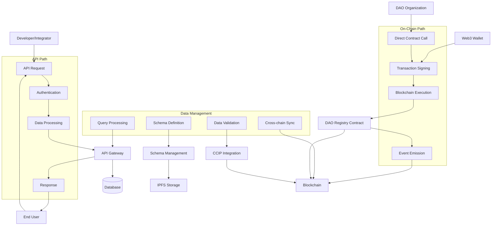
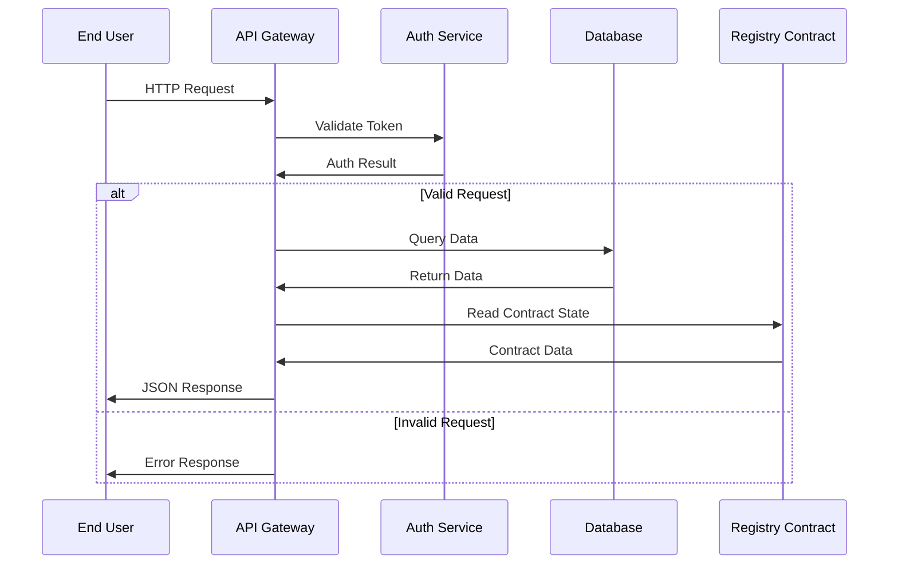
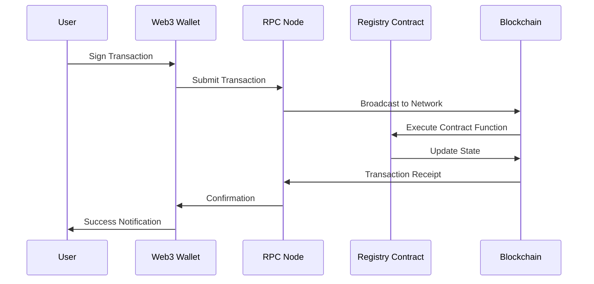
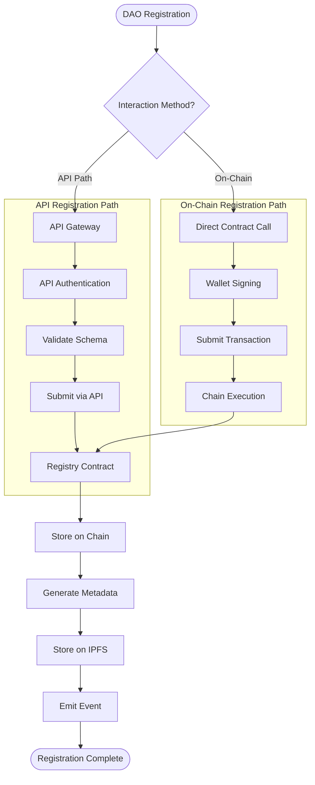
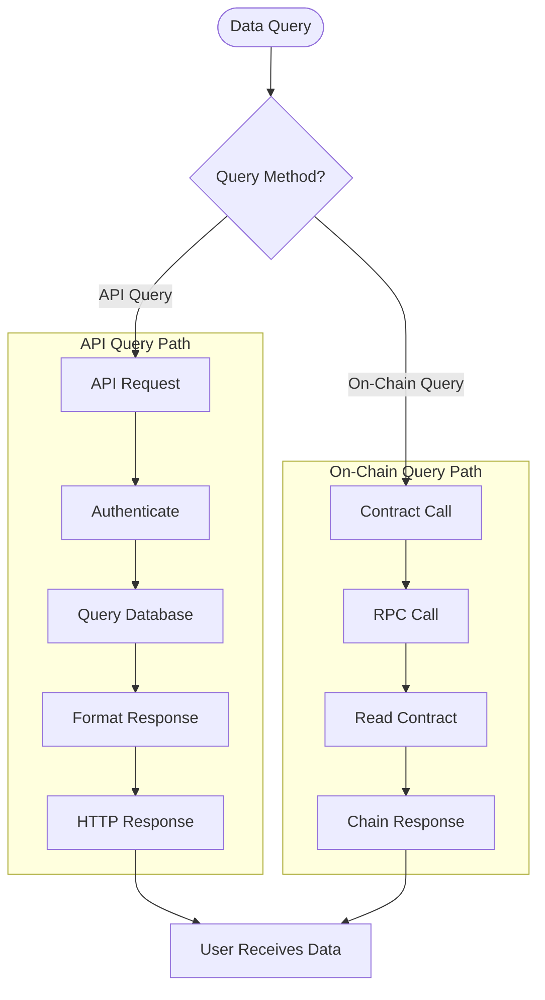
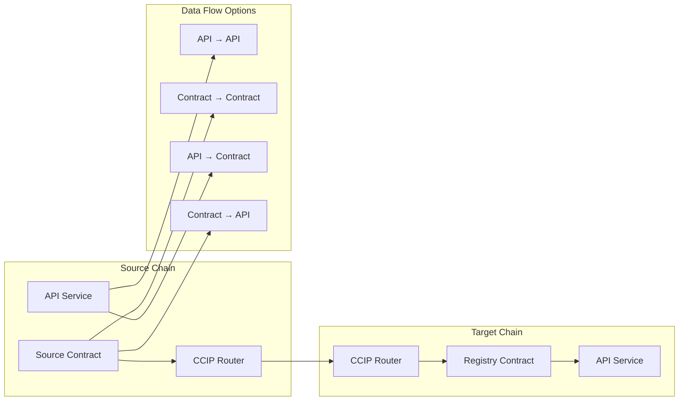
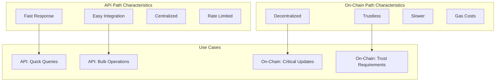

# DAO Registry Workflow Diagram

## System Overview

## Dual Interaction Paths

### 1. API Call Path

### 2. On-Chain Call Path

## Detailed Process Flow

### 1. DAO Registration Process (Dual Paths)

### 2. Data Query Process (Dual Paths)

### 3. Cross-Chain Data Flow

### 4. API vs On-Chain Comparison

## Key Components Interaction

### API Gateway Features
- **Authentication**: JWT token validation
- **Rate Limiting**: Request throttling
- **Caching**: Response optimization
- **Documentation**: OpenAPI specs
- **Error Handling**: Standardized responses

### On-Chain Contract Features
- **Gas Optimization**: Efficient function calls
- **Event Emission**: Real-time updates
- **Access Control**: Role-based permissions
- **Upgradeability**: Proxy pattern support
- **Verification**: Source code verification

### Dual Path Integration
- **Event Listening**: API listens to contract events
- **Data Sync**: Database mirrors chain state
- **Fallback**: API can query chain directly
- **Consistency**: Both paths return same data format

## Data Flow Summary

### API Path Flow
1. **Request**: HTTP/HTTPS call to API endpoint
2. **Authentication**: JWT token validation
3. **Processing**: Business logic and data formatting
4. **Response**: JSON response with status codes

### On-Chain Path Flow
1. **Transaction**: User signs transaction with wallet
2. **Submission**: Transaction broadcast to network
3. **Execution**: Smart contract function execution
4. **Confirmation**: Transaction confirmation and events

### Hybrid Approach
- **Read Operations**: Prefer API for speed
- **Write Operations**: Prefer on-chain for trust
- **Critical Data**: Always verify on-chain
- **User Experience**: API for UI, on-chain for security

## Security & Validation

### API Security
- **JWT Tokens**: Secure authentication
- **Rate Limiting**: Prevent abuse
- **Input Validation**: Sanitize all inputs
- **HTTPS**: Encrypted communication

### On-Chain Security
- **Cryptographic Verification**: Digital signatures
- **Access Control**: Role-based permissions
- **Reentrancy Protection**: Secure contract patterns
- **Audit Trail**: Immutable transaction history

## Performance Optimizations

### API Optimizations
- **Caching**: Redis for frequent queries
- **CDN**: Global content delivery
- **Database Indexing**: Fast query performance
- **Connection Pooling**: Efficient database connections

### On-Chain Optimizations
- **Gas Optimization**: Efficient contract code
- **Batch Operations**: Multiple operations in single transaction
- **Event Filtering**: Efficient event processing
- **State Management**: Optimized storage patterns 